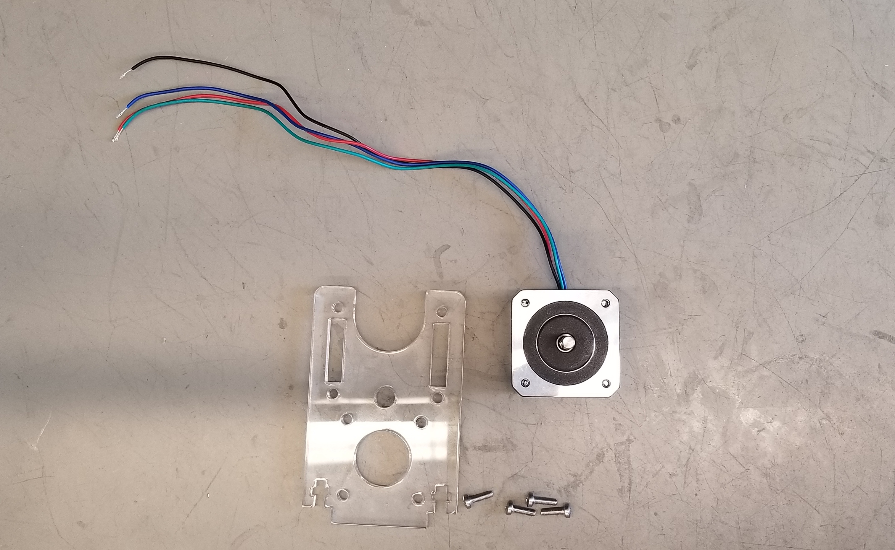
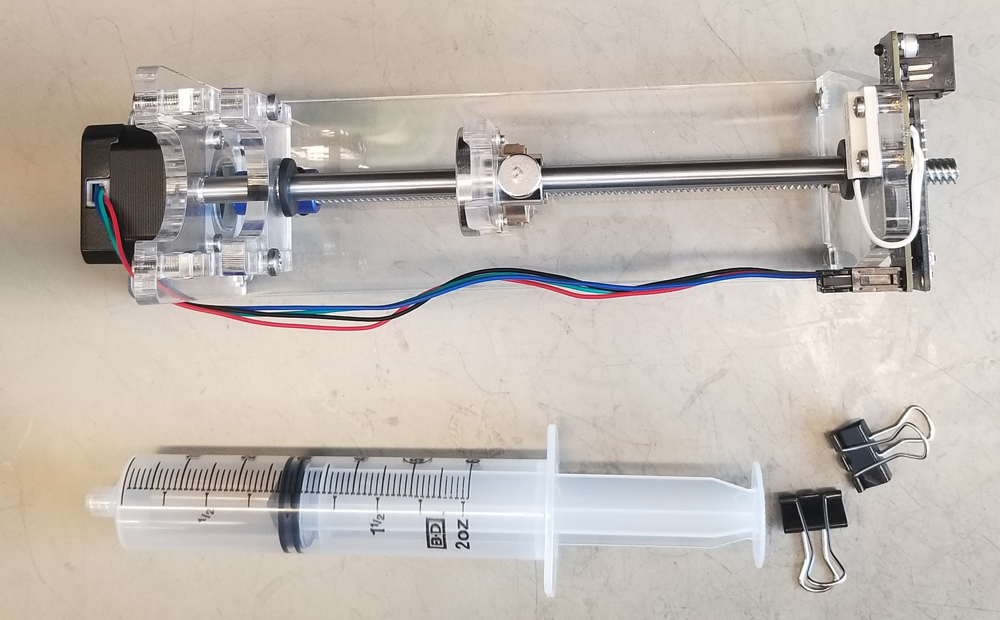
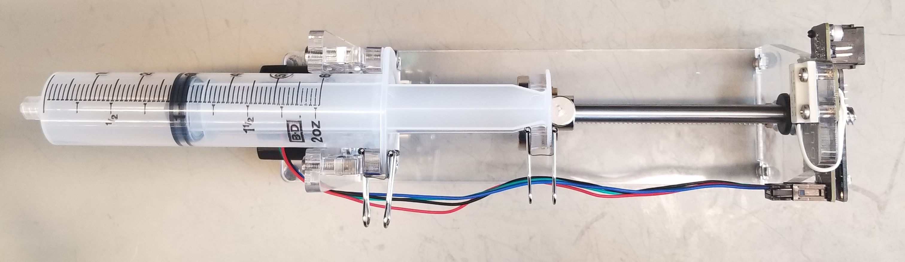

=====
Frame
=====

.. include:: isogrk1.txt

Design Files
============

`On GitHub <https://github.com/Karpova-Lab/syringe-pump/tree/master/2D%20CAD>`_

Bill of Materials
=================

+-----+------------------------------+-------+---------------------------------------------------------------------------------------------------------------------------------------------------------------------------------------+---------------+
| QTY | Description                  | Price | Part Number                                                                                                                                                                           | Supplier      |
+=====+==============================+=======+=======================================================================================================================================================================================+===============+
| 1   | Lasercut Acrylic             | 67.00 | ` <>`_                                                                                                                                                                                | Ponoko        |
+-----+------------------------------+-------+---------------------------------------------------------------------------------------------------------------------------------------------------------------------------------------+---------------+
| 1   | 300 x 8mm lead screw         | 9.99  | `634050 <https://www.servocity.com/lead-screws#371=448>`_                                                                                                                             | ServoCity     |
+-----+------------------------------+-------+---------------------------------------------------------------------------------------------------------------------------------------------------------------------------------------+               +
| 1   | 8mm lead screw nut           | 7.99  | `545315 <https://www.servocity.com/8mm-4-start-hub>`_                                                                                                                                 |               |
+-----+------------------------------+-------+---------------------------------------------------------------------------------------------------------------------------------------------------------------------------------------+               +
| 1   | 200 x  8 mm shaft            | 3.49  | `634310 <https://www.servocity.com/8mm-stainless-steel-precision-shafting#371=460>`_                                                                                                  |               |
+-----+------------------------------+-------+---------------------------------------------------------------------------------------------------------------------------------------------------------------------------------------+---------------+
| 1   | Nema 17  12v 26Ncm 200steps  | 6.97  | `17HS13-0404S <http://www.omc-stepperonline.com/nema-17-stepper-motor-34mm-12v-04a-26ncm37ozin-17hs130404s-p-166.html>`_                                                              | STEPPERONLINE |
+-----+------------------------------+-------+---------------------------------------------------------------------------------------------------------------------------------------------------------------------------------------+---------------+
| 1   | 5 mm to 8 mm coupler         | 8.00  | `B01M287GNY <https://www.amazon.com/RepRap-Champion-Coupler-Routers-printers/dp/B01M287GNY/ref=sr_1_12?ie=UTF8&qid=1488495177&sr=8-12&keywords=5+to+8mm+coupler>`_                    | Amazon        |
+-----+------------------------------+-------+---------------------------------------------------------------------------------------------------------------------------------------------------------------------------------------+               +
| 1   | Flanged LMF8UU slide bearing | 7.00  | `B00NQ2H8YU <https://www.amazon.com/uxcell-LMF8UU-Inside-Flange-Bearing/dp/B00NQ2H8YU/ref=sr_1_1?rps=1&ie=UTF8&qid=1488498852&sr=8-1&keywords=LMF8UU&refinements=p_85%3A2470955011>`_ |               |
+-----+------------------------------+-------+---------------------------------------------------------------------------------------------------------------------------------------------------------------------------------------+---------------+
| 1   | Grommet                      | 11.00 | `9600k54 <https://www.mcmaster.com/#9600k54>`_                                                                                                                                        | McMaster-Carr |
+-----+------------------------------+-------+---------------------------------------------------------------------------------------------------------------------------------------------------------------------------------------+               +
| 1   | Flanged Sleeve Bearing       | 3.32  | `5448T2 <https://www.mcmaster.com/#5448T2>`_                                                                                                                                          |               |
+-----+------------------------------+-------+---------------------------------------------------------------------------------------------------------------------------------------------------------------------------------------+               +
| 10  | M4 x 16mm machine screws     | 4.32  | `92005A220 <https://www.mcmaster.com/#92005A226>`_                                                                                                                                    |               |
+-----+------------------------------+-------+---------------------------------------------------------------------------------------------------------------------------------------------------------------------------------------+               +
| 10  | M4  square nut               | 10.00 | `96887A329 <https://www.mcmaster.com/#96887A329>`_                                                                                                                                    |               |
+-----+------------------------------+-------+---------------------------------------------------------------------------------------------------------------------------------------------------------------------------------------+               +
| 6   | M3 x 12mm machine screws     | 2.64  | `92005A122 <https://www.mcmaster.com/#92005A122>`_                                                                                                                                    |               |
+-----+------------------------------+-------+---------------------------------------------------------------------------------------------------------------------------------------------------------------------------------------+               +
| 6   | M3 Threaded inserts          | 7.20  | `94510A240 <https://www.mcmaster.com/#94510A240>`_                                                                                                                                    |               |
+-----+------------------------------+-------+---------------------------------------------------------------------------------------------------------------------------------------------------------------------------------------+               +
| 4   | Binder clips                 | 2.00  | `12755t73 <https://www.mcmaster.com/#12755t73>`_                                                                                                                                      |               |
+-----+------------------------------+-------+---------------------------------------------------------------------------------------------------------------------------------------------------------------------------------------+---------------+

.. image:: frame_assembly/1_parts_overview.jpg
  :align: center
  :scale: 100 %

Assembly Instructions
=====================

Required Tools
--------------
- Phillips screwdriver
- Allen wrench (included with shaft coupler)

Instructions
------------

1. Mount motor

.. image:: frame_assembly/3_add_coupler.jpg
  :align: center
  :scale: 100 %

2. Add coupler

.. image:: frame_assembly/4_assemble_carriage.jpg
  :align: center
  :scale: 100 %

3. Assemble syringe carriage

.. image:: frame_assembly/5_assemble_stage.jpg
  :align: center
  :scale: 100 %

4. Assemble stage

.. image:: frame_assembly/6_mount_carriage_and_stage.jpg
  :align: center
  :scale: 100 %

5. Mount syringe carriage and stage

.. image:: frame_assembly/7_assemble_tail_support.jpg
  :align: center
  :scale: 100 %

6. Assemble end support

.. image:: frame_assembly/8_assemble_base.jpg
  :align: center
  :scale: 100 %

7. Attach rubber bumper to base

.. image:: frame_assembly/9_attach_to_base.jpg
  :align: center
  :scale: 100 %

8. Mount everything to the base

.. image:: frame_assembly/10_add_controller.jpg
  :align: center
  :scale: 100 %

9. Attach connector to wires, mount controller to end support, and attach magnet to linear bearing

10. Attache syringe

.. image:: frame_assembly/final_side_3.jpg
  :align: center
  :scale: 100 %

11. Done!
