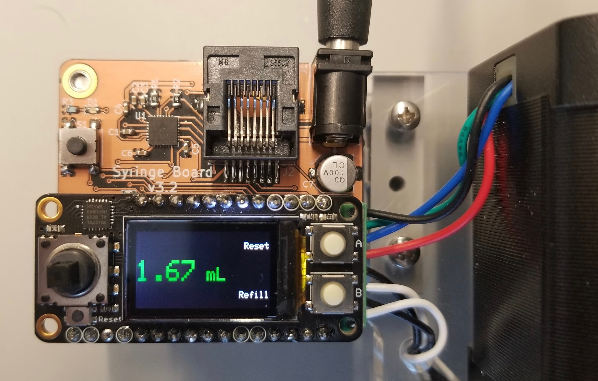

:github_url: https://github.com/Karpova-Lab/syringe-pump

==========
Electrical
==========
.. include:: isogrk1.txt

In order to control the movement of the pump you need two basic elements: a **stepper motor driver** and a **microcontroller**.

A **stepper motor driver** takes care of delivering the proper sequence of signals to rotate the stepper motor smoothly and accurately.
A **microcontroller** talks to the stepper motor driver, telling it when to rotate the motor, how fast, and in which direction.

Purchasing Electronic Modules
+++++++++++++++++++++++++++++
There are many options for combining these two elements in order to control your syringe pump. Here are some possibilities from Sparkfun and Adafruit:

- `Arduino Uno and Easy Driver <https://learn.sparkfun.com/tutorials/easy-driver-hook-up-guide>`_ 
- `Arduino Uno and Big Easy Driver <https://learn.sparkfun.com/tutorials/big-easy-driver-hookup-guide>`_ 
- `Arduino Uno with Stepper Motor Shield <https://learn.adafruit.com/adafruit-motor-shield-v2-for-arduino/using-stepper-motors>`_ 
- `Adafruit Feather and Motor Driver FeatherWing <https://learn.adafruit.com/adafruit-stepper-dc-motor-featherwing/overview>`_ 

Building Custom Circuit Board Assembly
++++++++++++++++++++++++++++++++++++++

An alternative to purchasing and combining the modules above, is to build the following custom circuit board. 
The custom "Syringe Board" circuit board combines a microcontroller, stepper driver, power jack, and motor terminal connections onto one board. 
It uses the same chips and is functionally equivalent to an `Adafruit Feather 32u4 <https://www.adafruit.com/product/2771>`_ microcontroller and a `TMC2208 SilentStepStick <https://www.digikey.com/product-detail/en/trinamic-motion-control-gmbh/TMC2208-SILENTSTEPSTICK/1460-1201-ND/6873626>`_ stepper driver. 
Additonally, it includes headers that allow you to attach FeatherWings. This provides flexibility to add displays such as the `Mini Color TFT with Joystick <https://www.adafruit.com/product/3321>`_ or `Featherwing OLED <https://www.adafruit.com/product/2900>`_, or add wireless control with a `Radio FeatherWing <https://www.adafruit.com/product/3229>`_. 

Bill of Materials
=================

+-----+----------------+------------------------+---------------------------------------------------------------------------------------------------------------------------------+
| Qty | Reference      | Description            | Value/MPN                                                                                                                       | 
+=====+================+========================+=================================================================================================================================+
| 1   | C1             | 0603 Capacitor         | `22nF <https://www.digikey.com/products/en?keywords=1276-6534-1>`_                                                              | 
+-----+----------------+------------------------+---------------------------------------------------------------------------------------------------------------------------------+
| 4   | C5, C4, C3, C2 | 0603 Capacitor         | `100nF <https://www.digikey.com/products/en?keywords=1276-1258-1-ND>`_                                                          | 
+-----+----------------+------------------------+---------------------------------------------------------------------------------------------------------------------------------+
| 1   | C6             | 0603 Capacitor         | `2.2µF <https://www.digikey.com/products/en?keywords=399-7886-1-ND>`_                                                           | 
+-----+----------------+------------------------+---------------------------------------------------------------------------------------------------------------------------------+
| 1   | C7             | Electrolytic Capacitor | `100uF <https://www.digikey.com/products/en?keywords=493-2203-1-ND>`_                                                           | 
+-----+----------------+------------------------+---------------------------------------------------------------------------------------------------------------------------------+
| 1   | D1             | Indicator LED          | `Red <https://www.digikey.com/products/en?keywords=160-1447-1-ND>`_                                                             | 
+-----+----------------+------------------------+---------------------------------------------------------------------------------------------------------------------------------+
| 4   | H1, H3, H2, H4 | Standoff               | `4207 <https://www.adafruit.com/product/4207>`_                                                                                 | 
+-----+----------------+------------------------+---------------------------------------------------------------------------------------------------------------------------------+
| 1   | J1             | DC Jack                | `PJ-037A <https://www.digikey.com/product-detail/en/cui-inc/PJ-037A/CP-037A-ND/1644545>`_                                       | 
+-----+----------------+------------------------+---------------------------------------------------------------------------------------------------------------------------------+
| 1   | J2             | RJ45 Jack              | `0855025008 <https://www.digikey.com/products/en?keywords=wm3547ct-nd>`_                                                        | 
+-----+----------------+------------------------+---------------------------------------------------------------------------------------------------------------------------------+
| 1   | J3             | 8pos Screw Terminal    | `OSTVN08A150 <https://www.digikey.com/product-detail/en/OSTVN08A150/ED10566-ND/1588868/?itemSeq=270117158>`_                    | 
+-----+----------------+------------------------+---------------------------------------------------------------------------------------------------------------------------------+
| 1   | J4             | Micro USB Socket       | `10118194-0001LF <https://www.digikey.com/products/en?keywords=609-4618-1-nd>`_                                                 | 
+-----+----------------+------------------------+---------------------------------------------------------------------------------------------------------------------------------+
| 1   | J5             | 16-pin Female Header   | `PPTC161LFBN-RC <https://www.digikey.com/product-detail/en/sullins-connector-solutions/PPTC161LFBN-RC/S7014-ND/810154>`_        | 
+-----+----------------+------------------------+---------------------------------------------------------------------------------------------------------------------------------+
| 1   | J6             | 12-pin Female Header   | `PPTC121LFBN-RC <https://www.digikey.com/product-detail/en/sullins-connector-solutions/PPTC121LFBN-RC/S6100-ND/807231>`_        | 
+-----+----------------+------------------------+---------------------------------------------------------------------------------------------------------------------------------+
| 2   | R1, R2         | 0805 Resistor          | `0.3Ω <https://www.digikey.com/products/en?keywords=p19247ct>`_                                                                 | 
+-----+----------------+------------------------+---------------------------------------------------------------------------------------------------------------------------------+
| 3   | R4, R5, R3     | 0603 Resistor          | `10KΩ <https://www.digikey.com/products/en?keywords=311-10KGRCT-ND>`_                                                           | 
+-----+----------------+------------------------+---------------------------------------------------------------------------------------------------------------------------------+
| 2   | R6, R7         | 0603 Resistor          | `27Ω <https://www.digikey.com/products/en?keywords=541-27.0sct>`_                                                               | 
+-----+----------------+------------------------+---------------------------------------------------------------------------------------------------------------------------------+
| 1   | S1             | Tactile switch         | `B3FS-1010P <https://www.digikey.com/products/en?keywords=sw1440ct>`_                                                           | 
+-----+----------------+------------------------+---------------------------------------------------------------------------------------------------------------------------------+
| 1   | U1             | Motor Driver IC        | `TMC2208 <https://www.digikey.com/products/en?keywords=1460-1184-1-ND>`_                                                        | 
+-----+----------------+------------------------+---------------------------------------------------------------------------------------------------------------------------------+
| 1   | U2             | 3.3V Voltage Regulator | `ROF-78E3.3-0.5SMD-R <https://www.digikey.com/product-detail/en/ROF-78E3.3-0.5SMD-R/945-1689-1-ND/3593418/?itemSeq=270101613>`_ | 
+-----+----------------+------------------------+---------------------------------------------------------------------------------------------------------------------------------+
| 1   | U3             | Microcontroller        | `ATMEGA32U4 <https://www.digikey.com/products/en?keywords=atmega32u4-au-nd>`_                                                   | 
+-----+----------------+------------------------+---------------------------------------------------------------------------------------------------------------------------------+
| 1   | Y1             | Resonator              | `8MHz <https://www.digikey.com/products/en?keywords=490-17958-1-ND>`_                                                           | 
+-----+----------------+------------------------+---------------------------------------------------------------------------------------------------------------------------------+

.. raw:: html

  

    <a href="_static/ibom.html" style="background-color: #2980b9;
    border: none;
    color: white;
    padding: 15px 15px;
    text-align:center;
    text-decoration: none;
    display: inline-block;
    font-size: 18px;
    border-radius:15px">View interactive BOM</a>
  

.. figure:: PCB/render.jpg
  :align: center
  :width: 100%

  PCB render

  
  PCB with display

.. PCB Files
.. =========

.. Use these files for ordering PCBs and solder paste stencils from your vendor of choice. 

.. Assembly
.. ========

.. Required Tools
.. --------------
.. - Soldering Iron
.. - wire strippers
.. - wire cutters

.. Programming
.. ===========

.. 1. Connect to ICSP pins
.. #. Burn bootloader
.. #. Upload syringe sketch.