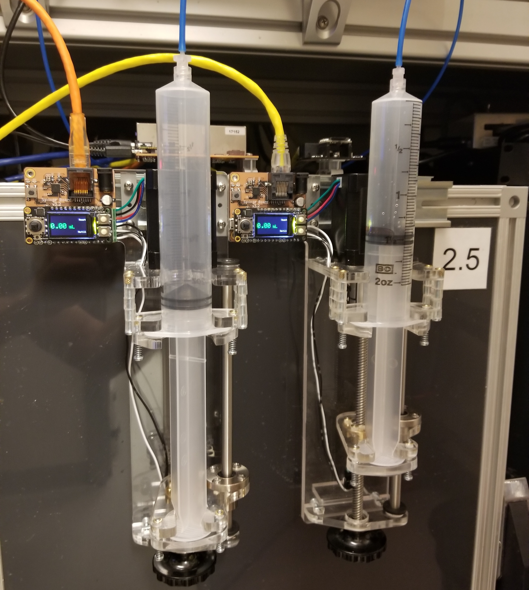

:github_url: https://github.com/Karpova-Lab/syringe-pump

.. Syringe Pump documentation master file, created by
   sphinx-quickstart on Wed Mar  1 17:44:06 2017.
   You can adapt this file completely to your liking, but it should at least
   contain the root `toctree` dir.. include:: isogrk1.txt

.. include:: isogrk1.txt

============
Syringe Pump
============

.. image:: images/renders/vertical.gif
  :width: 35%

Features
==========
- Infuse and retract capable syringe pump
- Frame is made of lasercut parts and standard hardware
- Small footprint (330 mm x 140 mm x 100 mm). Can be mounted vertically or set on surface
- Cost ~ $200
- Assembly time ~30 minutes
- Linear resolution = 2.5 |mgr|\ m. Volume resolution with 60mL syringe is 1.4 |mgr|\ L
- Can receive commands over UART using `pyControl <https://pycontrol.readthedocs.io/en/latest/>`_ 
- Motor controller includes color display and joystick/buttons for manual control

Background
==========

The goal of this project is to provide an easy to assemble, open-source syringe pump that is significantly less expensive than commercial pumps, while maintaining a sufficient level of dispense resolution and repeatability.

.. raw:: html

  
This is not the only open-source syringe pump that exists. Here are some other projects you may be interested in:

- `Poisedon <https://pachterlab.github.io/poseidon/>`_ by the Pachter Lab
- `Low cost laser cut syringe pump <http://jvoigts.scripts.mit.edu/blog/low-cost-syringe-pump/>`_ by Jakob Voigts
- `Open-source syringe pump <http://www.appropedia.org/Open-source_syringe_pump>`_  by Michigan Tech's Open Sustainability Technology Lab
- `3D Printed Syringe Pump Rack <https://hackaday.com/2015/05/29/pump-up-the-volume-with-the-3d-printed-syringe-pump-rack/>`_ by aldricnegrier
- `DIY Syringe Pump <https://hackaday.com/2017/02/26/diy-syringe-pump-saves-big-bucks-for-hackers-lab/>`_  by Naroom

Documentation Outline
=====================
.. toctree::

   controller.rst
   frame.rst
   manual.rst
   license.rst
