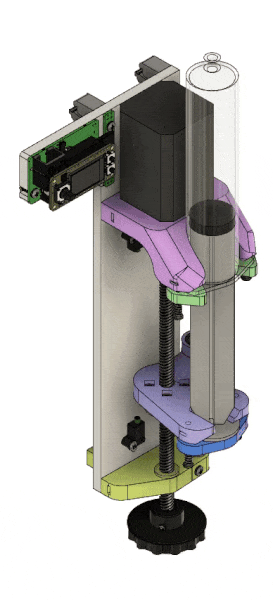

# Overview

<a href="vertical_render.gif">
  
  </img>
</a>

<a href="iso_views.png">
  
  </img>
</a>

## Features
- Infuse and retract capable syringe pump
- Frame is made of lasercut parts and standard hardware
- Small footprint (330 mm x 140 mm x 100 mm). Can be mounted vertically or set on surface
- Cost ~ $200
- Assembly time ~30 minutes
- Linear resolution = 2.5 µm. Volume resolution with 60mL syringe is 1.4 µL
- Can receive commands over UART using [pyControl](https://pycontrol.readthedocs.io/en/latest/)
- Motor controller includes color display and joystick/buttons for manual control

## Background

The goal of this project is to provide an easy to assemble, open-source syringe pump that is significantly less expensive than commercial pumps, while maintaining a sufficient level of dispense resolution and repeatability.

This is not the only open-source syringe pump that exists. Here are some other projects you may be interested in:

- [Open-source syringe pump](http://www.appropedia.org/Open-source_syringe_pump)  by Michigan Tech's Open Sustainability Technology Lab
- [Low cost laser cut syringe pump](http://jvoigts.scripts.mit.edu/blog/low-cost-syringe-pump/) by Jakob Voigts
- [Poisedon](https://pachterlab.github.io/poseidon/) by the Pachter Lab
- [3D Printed Syringe Pump Rack](https://hackaday.com/2015/05/29/pump-up-the-volume-with-the-3d-printed-syringe-pump-rack/) by aldricnegrier
- [DIY Syringe Pump](https://hackaday.com/2017/02/26/diy-syringe-pump-saves-big-bucks-for-hackers-lab/)  by Naroom

## Demo

<iframe src="https://player.vimeo.com/video/543307158?title=0&byline=0&portrait=0" style="position:absolute;top:0;left:0;width:100%;height:100%;" frameborder="0" allow="autoplay; fullscreen; picture-in-picture" allowfullscreen></iframe>

 


