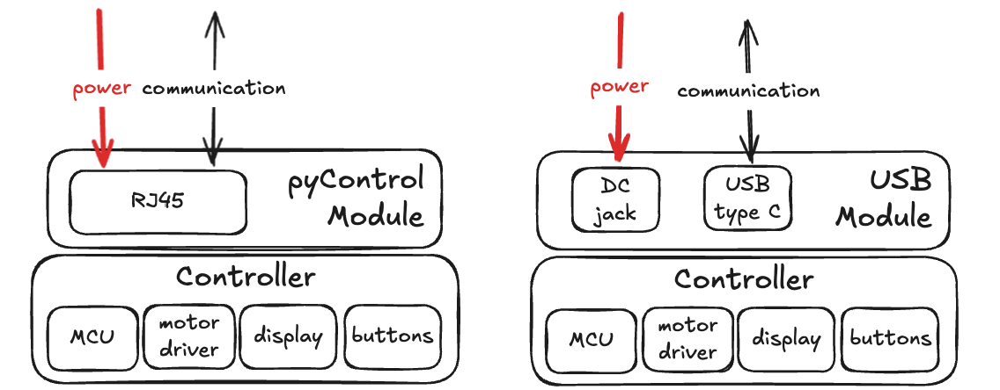
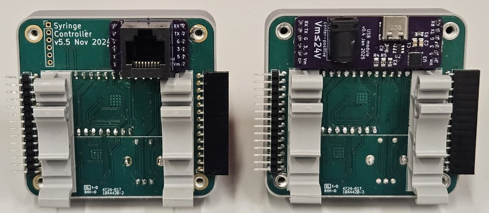
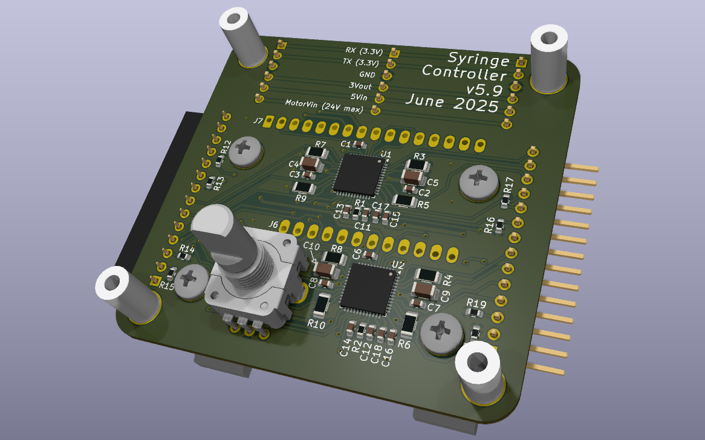
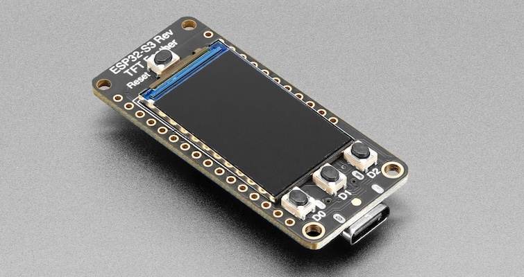
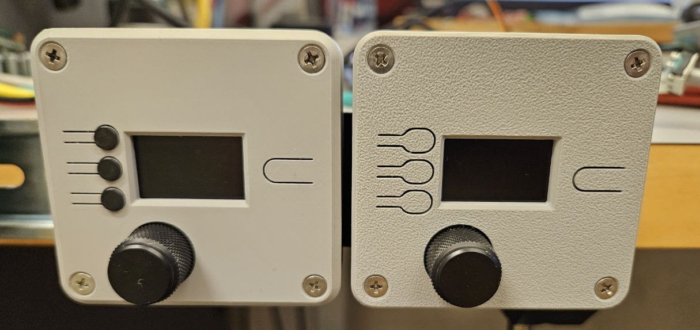
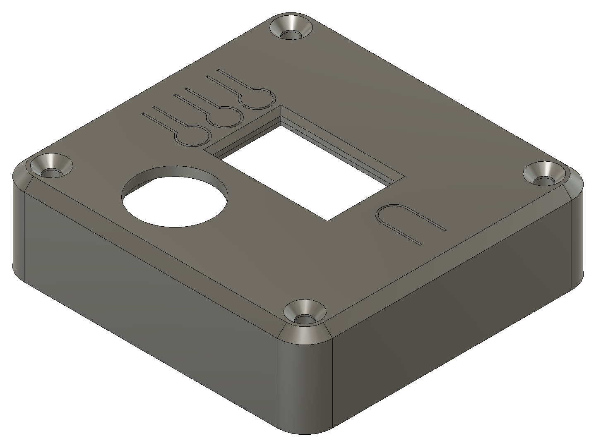
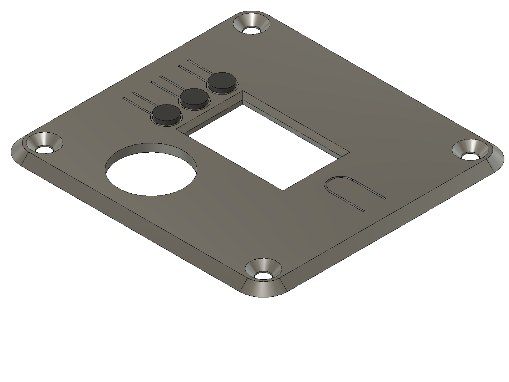
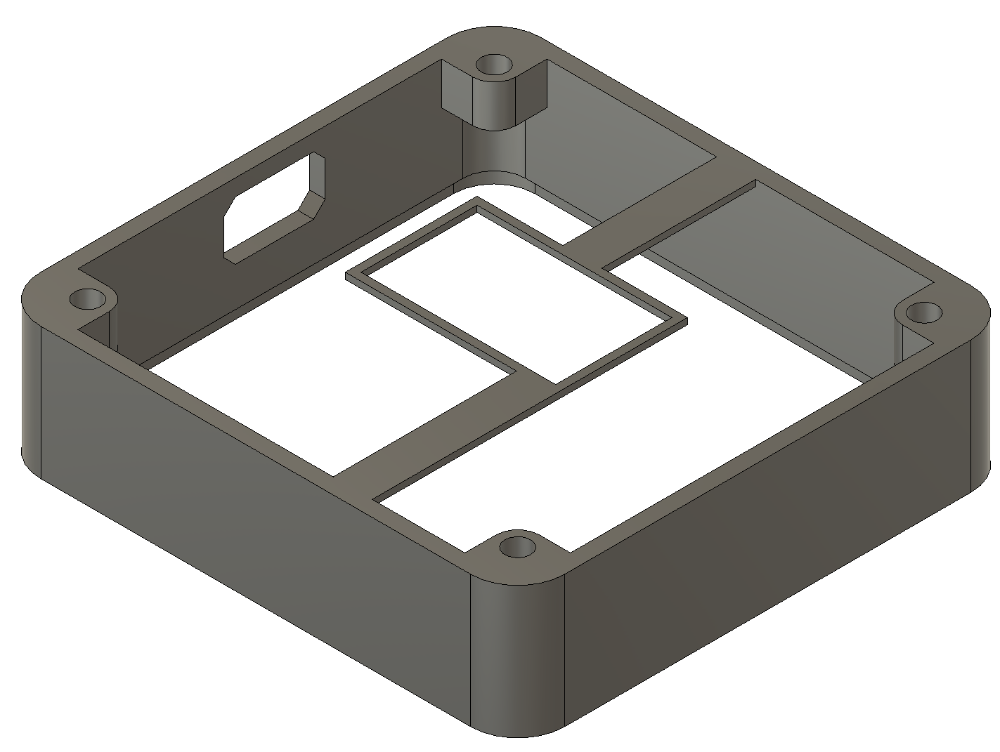
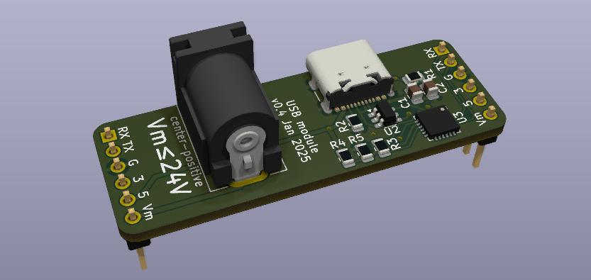
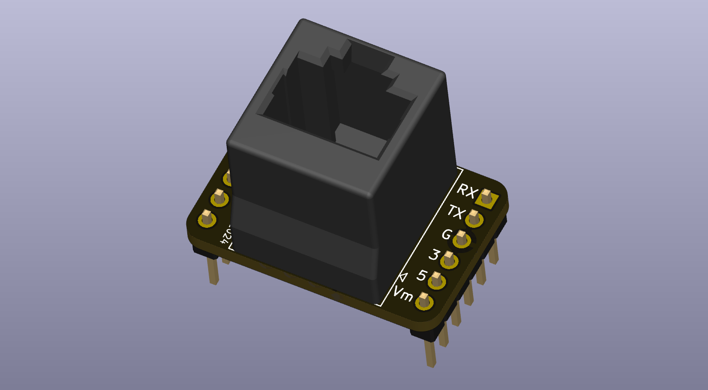

# Controller

/// caption
Controller with modular design
///

The controller is capable of managing up to four syringe pumps.
The interface consists of a color display (240x135 pixels), three buttons, and a rotatable knob that can also be pressed as a button.
Remote commands are received through a [UART serial connection](https://learn.sparkfun.com/tutorials/serial-communication/serial-intro).

!!! tip "Connector modules"
    Through-hole pads on the backside of the controller provide access to the power and communication connections.
    Connector modules can be created and attached to the controller to add particular interfaces.
    This modular approach allows the controller to be compatible with a variety of systems.

/// caption
On the left, the controller with a [pyControl module](#pycontrol-module) attached.
On the right, the controller with a [USB module](#usb-module) attached.
///

???+ info "Fancy motor driver"

    Precise control of the stepper motor's rotation is essential for accurately dispensing liquid from the syringe pump.
    This typically involves control software running on a computer that communicates with a microcontroller to determine:

    - When to start rotating
    - Which direction to rotate
    - How far to rotate
    - How fast to rotate

    Traditionally, the microcontroller is responsible for calculating the number and timing of partial rotations (steps) based on the target position and acceleration/velocity curves. 
    It sends precisely timed step and direction signals to a stepper motor driver IC, which then supplies current to the motor coils in a specific sequence, creating a rotating magnetic field that moves the motor shaft incrementally[^1].

    [^1]: See [this video](https://youtu.be/eyqwLiowZiU?t=152) for a great explanation of how hybrid stepper motors work.

    There are [algorithms](homepage/Stepper_Motor_Speed_Profile.pdf) and some great software libraries ([AccelStepper](https://github.com/waspinator/AccelStepper), [TeensyStep](https://github.com/luni64/TeensyStep), [TMCStepper](https://github.com/teemuatlut/TMCStepper), [TMC2209](https://github.com/janelia-arduino/TMC2209), [FastAcelStepper](https://github.com/gin66/FastAccelStepper), [stepper_pio](https://github.com/ktritz/stepper_pio)) that assist with this timing and signal generation, but depending on the microcontroller chosen, compatibility and performance can be limited.
    
    This controller utilizes are a really neat motor driver that takes care of all of the timing and step generation itself.
    The microcontroller simply sets acceleration and velocity parameters, provides a target position, and the driver executes the motion profile. 
    This drastically simplifies the microcontroller’s firmware and frees up processing for other tasks.
        

## Controller

### Circuit Board
!!! tip "Ordering PCBs"
    Order the PCB and stencil from [OSH Park](https://oshpark.com/) or [Aisler](https://aisler.net/), or manually upload the gerber files to your preferred PCB manufacturer.

[:material-file-download: Download gerber files](controller/controller/controller_v5.9.zip){ .md-button }

[:material-cart: Order from OSH Park](https://oshpark.com/shared_projects/FrXn6kK5){ .md-button } [:material-cart: Order from Aisler](https://aisler.net/p/BWPXCAQW){ .md-button }

/// caption
Controller PCB render
///

-   #### Schematic
    ---
    <a href="controller/schematic.pdf">
        
        </img>
    </a>

-   #### Layout
    ---
    <a href="controller/layout.png">
        
        </img>
    </a>

### Bill of Materials

[:fontawesome-solid-arrow-pointer: View interactive BOM](controller/controller/ibom.html){ .md-button }

| Quantity | Reference              | Description                      | Value/MPN                                                                                                                                                      |
| :------: | ---------------------- | -------------------------------- | -------------------------------------------------------------------------------------------------------------------------------------------------------------- |
|    4     | C4, C5, C9, C10        | 1206 capacitor                   | [22µF](https://www.digikey.com/en/products/detail/tdk-corporation/C3216JB1V226M160AC/3948975?s=N4IgTCBcDaIMIGYwEYBsApAQsgamMqAsmgAwCCcIAugL5A)                 |
|    2     | C13, C14               | 0603 capacitor                   | [4.7µF](https://www.digikey.com/en/products/detail/samsung-electro-mechanics/CL10A475KP8NNNC/3886702)                                                          |
|    2     | C11, C12               | 0603 capacitor                   | [0.47µF](https://www.digikey.com/en/products/detail/samsung-electro-mechanics/CL10B474KO8VPNC/5961088)                                                         |
|    8     | C1-C3, C6-C8, C15, C16 | 0603 capacitor                   | [0.1µF](https://www.digikey.com/en/products/detail/samsung-electro-mechanics/CL10B104KB8NNNC/3886658)                                                          |
|    2     | C17, C18               | 0603 capacitor                   | [0.022µF](https://www.digikey.com/en/products/detail/samsung-electro-mechanics/CL10B223KB8WPNC/5961018?s=N4IgTCBcDaIIxgOwDYC0yCsBmALKuIAugL5A)                 |
|    2     | DRA1, DRA2             | DIN rail adapter                 | [1201578](https://www.digikey.com/en/products/detail/phoenix-contact/1201578/290934?s=N4IgTCBcDa4OxwLRjATgGyIHYBMQF0BfIA)                                      |
|    4     | H1-H4                  | 10 mm standoff                   | [24886](https://www.digikey.com/en/products/detail/keystone-electronics/24886/9921826?s=N4IgTCBcDaIMwDYC0YAsAOdyCMIC6AvkA)                                     |
|    1     | J1                     | 14-pin right angle female header | [PPTC141LGBN-RC](https://www.digikey.com/en/products/detail/sullins-connector-solutions/PPTC141LGBN-RC/775908?s=N4IgTCBcDaIM4FYAsCAMIC6BfIA)                   |
|    1     | J2                     | 14-pin right angle male header   | [PH1RB-14-UA](https://www.digikey.com/en/products/detail/adam-tech/PH1RB-14-UA/9831063?s=N4IgTCBcDa4AwFYDsBaACgCQIwCUBCKWALCgKoCCKAcgCIgC6AvkA)                |
|    1     | J6                     | 12-pin female header             | [PPTC121LFBN-RC](https://www.digikey.com/en/products/detail/sullins-connector-solutions/PPTC121LFBN-RC/807231)                                                 |
|    1     | J7                     | 16-pin female header             | [PPTC161LFBN-RC](https://www.digikey.com/en/products/detail/sullins-connector-solutions/PPTC161LFBN-RC/810154?s=N4IgTCBcDaIApwCoGECMA2VAZAYgIQDkBaAJWRAF0BfIA) |
|    8     | R12-R19                | 0603 resistor                    | [4.7KΩ](https://www.digikey.com/en/products/detail/yageo/RC0603FR-074K7L/727212)                                                                               |
|    2     | R1, R2                 | 0603 resistor                    | [2.2Ω](https://www.digikey.com/en/products/detail/yageo/RC0603FR-072R2L/2827592)                                                                               |
|    8     | R3-R10                 | 1206 resistor                    | [0.270Ω](https://www.digikey.com/en/products/detail/vishay-dale/RCWE1206R270FKEA/2276489?s=N4IgTCBcDaIEoGEDqBRAjGADANjmA7JgGIDSKAgiALoC+QA)                    |
|    1     | SW1                    | Rotary encoder with button       | [PEC11R-4220F-S0024](https://www.digikey.com/en/products/detail/bourns-inc/PEC11R-4220F-S0024/4499660)                                                         |
|    2     | U1, U2                 | Motor driver                     | [TMC5041](https://www.digikey.com/en/products/detail/analog-devices-inc-maxim-integrated/TMC5041-LA-T/5249798)                                                 |

### Additional Components

/// caption
Adafruit ESP32-S3 Reverse TFT Feather
///

An [Adafruit ESP32-S3 Reverse TFT Feather](https://learn.adafruit.com/esp32-s3-reverse-tft-feather) is used to display the user interface and communicate with the stepper driver.
It can respond to commands from control software for automated/remote control, or signals from the physical buttons and knobs for manual control.

| Quantity | Description                  | Part Number                                                                                                                                | Supplier      |
| :------: | ---------------------------- | ------------------------------------------------------------------------------------------------------------------------------------------ | ------------- |
|    1     | ESP32-S3 Reverse TFT Feather | [5691](https://www.digikey.com/en/products/detail/adafruit-industries-llc/5691/18627502)                                                   | Digi-Key      |
|    1     | Encoder Knob[^2]             | [OEDNI-63-4-7](https://www.digikey.com/en/products/detail/kilo-international/OEDNI-63-4-7/5970335?s=N4IgTCBcDa5gbAWgCwEYDsBORA5AIiALoC+QA) | Digi-Key      |
|    4     | M3 x 8 mm flat head screw    | [92010A118](https://www.mcmaster.com/92010A118/)                                                                                           | McMaster-Carr |

[^2]: At $10, this knob is may be excessive, but at the same time, can you really put a price on the experience of a nicely knurled metal knob? 
Much less expensive alternatives that fit the encoder's 6mm diameter shaft do exist though.

### 3D Printed Case

A 3D printed case provides a protective housing for the controller.
There is a single piece version that is simpler to print,
and a two piece version with raised buttons that can be printed in a contrasting color.

/// caption
On the left, 2-piece multicolor design with raised buttons.
On the right, an easier to print 1-piece design.
///

=== "1-piece"
	{ width="49%" }

    [:material-file-download: Download 1-piece 3D files](controller/controller/case_one_piece.3mf){ .md-button }

=== "2-piece"
	{ width="49%" }
	{ width="49%" }

    !!! warning "Print settings"
        For best results it is recommended to print the case with a **0.08 mm layer height** on a [smooth surface](https://us.store.bambulab.com/products/bambu-smooth-pei-plate).

    [:material-file-download: Download 2-piece 3D files](controller/controller/case_two_piece.3mf){ .md-button }

## USB Module

### Circuit Board

[:material-file-download: Download gerber files](controller/usbmodule/module_usb_v0.4.zip){ .md-button }

[:material-cart: Order from OSH Park](https://oshpark.com/shared_projects/Z94jEvg3){ .md-button } [:material-cart: Order from Aisler](https://aisler.net/p/OABMFOKD){ .md-button }

/// caption
USB Module PCB render
///

-   #### Schematic
    ---
    <a href="usbmodule/schematic.pdf">
        
        </img>
    </a>

-   #### Layout
    ---
    <a href="usbmodule/layout.png">
        
        </img>
    </a>

### Bill of Materials

[:fontawesome-solid-arrow-pointer: View interactive BOM](controller/usbmodule/ibom.html){ .md-button }

| Quantity | Reference   | Description          | Value/MPN                                                                                                                       |
| :------: | ----------- | -------------------- | ------------------------------------------------------------------------------------------------------------------------------- |
|    1     | C1          | 0805 capacitor       | [10µF](https://www.digikey.com/en/products/detail/kemet/C0805C106K9PACTU/551604)                                                |
|    1     | C2          | 0805 capacitor       | [100nF](https://www.digikey.com/en/products/detail/kemet/C0805C104K9RACTU/2211746)                                              |
|    1     | D1          | LED                  | [Green](https://www.digikey.com/en/products/detail/w%C3%BCrth-elektronik/150080VS75000/4489924)                                 |
|    1     | D2          | LED                  | [Red](https://www.digikey.com/en/products/detail/w%C3%BCrth-elektronik/150080YS75000/4489927)                                   |
|    1     | J2          | USB Type C connector | [USB4105-GF-A](https://www.digikey.com/en/products/detail/gct/USB4105-GF-A/11198441)                                            |
|    1     | J4          | DC Barrel Jack       | [PJ-037A](https://www.digikey.com/product-detail/en/cui-inc/PJ-037A/CP-037A-ND/1644545)                                         |
|    4     | R1,R2,R6,R7 | 0805 resistor        | [5.1KΩ](https://www.digikey.com/en/products/detail/yageo/RC0805JR-075K1L/728338)                                                |
|    1     | R3          | 0805 resistor        | [1KΩ](https://www.digikey.com/en/products/detail/yageo/RC0805FR-071KL/727444?s=N4IgTCBcDaIMwEYEFoEDoAMGDSBhASrgCrIByAIiALoC+QA) |
|    1     | R4          | 0805 resistor        | [22KΩ](https://www.digikey.com/en/products/detail/stackpole-electronics-inc/RMCF0805JT22K0/1757908)                             |
|    1     | R5          | 0805 resistor        | [47KΩ](https://www.digikey.com/en/products/detail/stackpole-electronics-inc/RMCF0805JT47K0/1757842)                             |
|    1     | U2          | TVS diode            | [USBLC6-2SC6](https://www.digikey.com/en/products/detail/stmicrocontroller/USBLC6-2SC6/1040559)                                 |
|    1     | U3          | USB to UART bridge   | [CP2102N-A02-GQFN24R](https://www.digikey.com/en/products/detail/silicon-labs/CP2102N-A02-GQFN24R/9863479)                      |

<!-- 

-   #### Interactive BOM
    ---
    <a href="usbmodule/ibom.html">
        
        </img>
    </a>

 -->

## pyControl Module

### Circuit Board

[:material-file-download: Download gerber files](controller/pycontrol/module_pycontrol_v0.3.zip){ .md-button }

[:material-cart: Order from OSH Park](https://oshpark.com/shared_projects/zDEl9cR0){ .md-button } [:material-cart: Order from Aisler](https://aisler.net/p/ATYDLVHG){ .md-button }

/// caption
pyControl module PCB render
///

-   #### Schematic
    ---
    <a href="pycontrol/schematic.pdf">
        
        </img>
    </a>

-   #### Layout
    ---
    <a href="pycontrol/layout.png">
        
        </img>
    </a>

### Bill of Materials

| Quantity | Reference | Description       | Value/MPN                                                                                             |
| :------: | --------- | ----------------- | ----------------------------------------------------------------------------------------------------- |
|    2     | J1,J3     | 6-pin male header | [0022285064](https://www.digikey.com/en/products/detail/molex/0022285064/6167125)                     |
|    1     | J2        | Vertical RJ45     | [PJ012-8P8C1](https://www.digikey.com/en/products/detail/on-shore-technology-inc/PJ012-8P8C1/6566534) |
