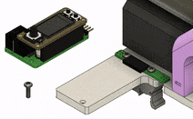

# Electronics

{ width=49% }
{ width=49% align=top }

<!--  </img> -->

## Modular Design
A major benefit of this syringe pump design is that the electronics are modular. 
A [7-pin female header socket](https://www.digikey.com/en/products/detail/sullins-connector-solutions/PPTC071LGBN-RC/775901?s=N4IgTCBcDaIM4FYAsSDMIC6BfIA) provides access to the bipolar stepper motor and two limit switches.

Dispensing liquid from a syringe pump requires precise control of stepper motor's rotation.
Typically, this involves having some control software running on a computer communicate to a microcontroller...

  - when to rotate
  - which direction to rotate
  - how far to rotate
  - how fast rotate

The microcontroller calculates the quantity and timing of partial rotations (steps) that will produce the intended motor movement.
This collection of precisely timed step signals is fed into a stepper motor driver IC, which in turn supplies current to motor coils in a sequence that creates a rotating magnetic field, causing the motor shaft to incrementally rotate ([here is a good video](https://youtu.be/eyqwLiowZiU?t=152) for more information on how hybrid stepper motors work).

<!-- The technology stack of control software, microcontroller, and stepper drivers can create many possible setups, each with their own tradeoffs. -->
<!-- There are many options for each element in the technology stack of control software + microcontroller + stepper drivers. 
Multiple options exist for each element in the technology stack of control software + microcontroller + stepper drivers. 
Various combinations create many possible solutions for creating a syringe pump controller. 
Because of this, many possible combinations can be used to control a syringe pump.
Because of this, there are many possible solutions for creating a syringe pump controller.  -->

Multiple options exist for each element in the technology stack (control software + microcontroller + stepper driver IC), thereby creating many possibilities for controlling a syringe pump.
For example, these three neuroscience labs developed the following solutions:

| Project                                                                                    | Software                                                              | Development Board (Microcontroller)                                                                                                                  | Stepper Driver                                                                                                                                     |
|--------------------------------------------------------------------------------------------|-----------------------------------------------------------------------|------------------------------------------------------------------------------------------------------------------------------------------------------|----------------------------------------------------------------------------------------------------------------------------------------------------|
| [Poulet Lab Bpod motor controller](https://github.com/poulet-lab/Bpod_Stepper)             | [Bpod](https://sites.google.com/site/bpoddocumentation/home)          | [Teensy 3.6](https://www.digikey.com/en/products/detail/sparkfun-electronics/DEV-14058/6569369?s=N4IgTCBcDaIIwFYBsAOAtHALEhaByAIiALoC%2BQA) (MK66FX) | [TMC2100](https://www.digikey.com/en/products/detail/watterott-electronic-gmbh/20150007-002/10071140?s=N4IgTCBcDa4IwAYEFowLgViQg7MpYyAcgCIgC6AvkA) |
| [Pachter Lab Poseidon System](https://github.com/pachterlab/poseidon)                      | [Poseidon Controller](https://pachterlab.github.io/poseidon/software) | [Arduino Uno](https://store-usa.arduino.cc/products/arduino-uno-rev3/) (ATMEGA328)                                                                   | [DRV8825](https://www.pololu.com/product/2133)                                                                                                     |
| [Karpova Lab SCB for pyControl](#pycontrol-syringe-control-board-scb)                      | [pyControl](https://pycontrol.readthedocs.io/en/latest/)              | [Feather M0 equivalent](https://www.adafruit.com/product/2772) (ATSAMD21)                                                                            | [TMC2209](https://www.digikey.com/en/products/detail/trinamic-motion-control-gmbh/TMC2209-LA-T/10232491?s=N4IgTCBcDaIC4FsDGYwAYCcIC6BfIA)          |

The existence of these multiple solutions highlights the importance of the syringe pump not being tied to a specific technology stack. 
The pump can benefit more users since the control electronics are decoupled from the rest of the syringe pump. 
One can easily swap in their own electronics to integrate the pump with their particular setup.
No more vendor lock-in! You should be able to use your syringe pumps with whatever system you choose. 
If a cool new display or better motor driver IC becomes available, upgrading the electronics should be an easy swap.

!!! info "Community Designs"

    Do you have ideas for a custom control board? A design that you've already built? 
    Consider sharing in the [discussions](https://github.com/Karpova-Lab/syringe-pump/discussions) for others to benefit from. 
    I can add community design links and information to this documentation page!

    To ensure compatibility with the existing [baseplate](hardware.md#laser-cut-parts), your PCB should include a [7-pin header](https://www.digikey.com/en/products/detail/adam-tech/PH1RB-07-UA/9831064?s=N4IgTCBcDa4AwFYDsBaADgCwIwCcBGKcSIAugL5A) and a mounting hole (refer to the [pyControl SCB layout](#printed-circuit-board) below for dimensions).
    <!-- Of course everything is open source though, so you could modify the baseplate design to fit you needs.  -->
    <!-- Maybe you want to mount a large PCB with a touch display or mount multiple pumps to single baseplate. -->

## pyControl Syringe Control Board (SCB)

In our lab we designed a motor controller that interfaces with [pyControl](https://pycontrol.readthedocs.io/en/latest/).
It receives power and communication from [pyControl hardware](https://karpova-lab.github.io/pyControl-D-Series-Breakout/index.html) via an RJ45 connection.

The PCB adheres to Adafruit's [feather wing specification](https://learn.adafruit.com/adafruit-feather/feather-specification?gclid=Cj0KCQjwsqmEBhDiARIsANV8H3ZFmbJizjrXAZ6NPPpIta56bA8-kGrnnz0L8A4EkraoURAJXrWPU-AaAiQDEALw_wcB).
This enables the possibility of plugging in a variety of "feather wings" to expand the controller's capabilities. 
For example a [display](https://www.adafruit.com/product/4650) or [radio communication](https://www.adafruit.com/product/3229) can be easily added. 

The motor controller can receive movement commands from pyControl and/or respond to user input from the onboard buttons.
Information and warnings can be shown on the display. 
In the past, we have used a [Mini color TFT with Joystick](https://www.adafruit.com/product/3321) feather wing. 
Currently, we use the more basic [4-digit 7-segment display](https://www.adafruit.com/product/3108). 

### Printed Circuit Board

The manufactured PCB contains two board designs which can be separated by breaking off the perforated "mousebite" tabs.
The skinny PCB is meant to permanently attach to the syringe frame and make connections with the stepper motor and limit switches.
It provides access to those connections through a 7-pin socket.
The larger PCB is a pyControl compatible device that plugs into the motor connection socket.

[Order PCB from OSH Park](https://oshpark.com/shared_projects/HIOVaYiQ)

=== "layout"
    <a href="layout.png">
        
        </img>
    </a>
=== "schematic"
    <a href="schematic.png">
        
        </img>
    </a>
=== "render"
    <a href="render.png">
    
    </img>
    </a>
=== "assembled"
    <a href="SCB_bare.jpeg">
    
    </img>
    </a>
=== "TFT display"
    [Mini color TFT with Joystick](https://www.adafruit.com/product/3321)
    <a href="SCB_tft.jpg">
    
    </img>
    </a>
=== "7-segment display"
    [4-digit 7-segment display](https://www.adafruit.com/product/3108)
    <a href="SCB_segment.jpg">
    
    </img>
    </a>

### Components BOM

| Qty | Reference          | Description                | Value/MPN                                                                                                                                         | 
|-----|--------------------|----------------------------|---------------------------------------------------------------------------------------------------------------------------------------------------|
| 5   | C1, C5, C6, C7, C8 | 0603 Capacitor             | [100nF](https://www.digikey.com/en/products/detail/samsung-electro-mechanics/CL10F104ZO8NNNC/3886916?s=N4IgTCBcDaIIxgOwDYC0CCsAOdqByAIiALoC%2BQA) | 
| 3   | C2, C3, C9         | 0603 Capacitor             | [2.2µF](https://www.digikey.com/en/products/detail/yageo/CC0603KRX5R8BB225/5195688)                                                               | 
| 1   | C4                 | Electrolytic Capacitor     | [100µF](https://www.digikey.com/en/products/detail/EMZA350ADA101MF80G/565-2559-1-ND/757720?itemSeq=363115427)                                     | 
| 1   | C10                | 0603 Capacitor             | [22nF](https://www.digikey.com/en/products/detail/samsung-electro-mechanics/CL10B223KB8WPNC/5961018?s=N4IgTCBcDaIIxgOwDYC0yCsBmALKuIAugL5A)       | 
| 3   | H1, H2, H3         | 2mm Standoff               | [9774010943R](https://www.digikey.com/en/products/detail/9774010943R/732-10938-1-ND/6644344?itemSeq=368534877)                                    | 
| 1   | J1                 | RJ45 Jack                  | [54602-908LF ](https://www.digikey.com/en/products/detail/54602-908LF/609-1046-ND/1001360)                                                        | 
| 1   | J2                 | 16-pin Female Header       | [ESQ-116-12-T-S](https://www.digikey.com/en/products/detail/samtec-inc/ESQ-116-12-T-S/7098325?s=N4IgTCBcDaIKIGUCKBaAjGgbOsKAqKCKAcgCIgC6AvkA)     | 
| 1   | J3                 | 12-pin Female Header       | [ESQ-112-12-T-S](https://www.digikey.com/en/products/detail/samtec-inc/esq-112-12-t-s/7097880)                                                    | 
| 1   | J4                 | 7-pin Right Angle Male     | [PH1RB-07-UA](https://www.digikey.com/en/products/detail/adam-tech/PH1RB-07-UA/9831064?s=N4IgTCBcDa4AwFYDsBaADgCwIwCcBGKcSIAugL5A)                | 
| 1   | J7                 | 7-pin Right Angle Female   | [PPTC071LGBN-RC](https://www.digikey.com/en/products/detail/sullins-connector-solutions/PPTC071LGBN-RC/775901?s=N4IgTCBcDaIM4FYAsSDMIC6BfIA)      | 
| 4   | R1, R2, R3, R5     | 0603 Resistor              | [10KΩ](https://www.digikey.com/en/products/detail/yageo/RC0603JR-0710KL/726700?s=N4IgTCBcDaIMwEYEFoEAYDSBxASgYQBVkA5AERAF0BfIA)                   | 
| 2   | R4, R6             | 0805 Resistor              | [0.3Ω](https://www.digikey.com/en/products/detail/panasonic-electronic-components/ERJ-6DQJR30V/6004330?s=N4IgTCBcDaIA4EYCcYAsB2AxgFxAXQF8g)       | 
| 3   | S1, S2, S3         | Right angle tactile switch | [PTS645VH39-2](https://www.digikey.com/en/products/detail/c-k/PTS645VH39-2-LFS/1146767)                                                           | 
| 1   | U1                 | 3.3V voltage regulator     | [BU33SD2MG](https://www.digikey.com/products/en?keywords=ZLDO1117G33DICT-ND)                                                                      | 
| 1   | U2                 | Microcontroller            | [ATSAMD21G](https://www.digikey.com/en/products/detail/microchip-technology/ATSAMD21G18A-AUT/4878867)                                             | 
| 1   | U3                 | Motor Driver               | [TMC2209](https://www.digikey.com/en/products/detail/trinamic-motion-control-gmbh/TMC2209-LA-T/10232491?s=N4IgTCBcDaIC4FsDGYwAYCcIC6BfIA)         | 
| 1   | U4                 | EEPROM                     | [AT24C01C-STUM](https://www.digikey.com/en/products/detail/microchip-technology/AT24C01C-STUM-T/3903734)                                          | 

<a href="ibom.html">
    
    </img>
</a>

### Assembly 
Cut wires to the following lengths:

- motor leads: 25 mm
- infuse limit switch: 70 mm
- retract limit switch: 235 mm

### Programming
- [Black Magic Probe](https://1bitsquared.com/products/black-magic-probe)
- [Tag-Connect 6pin RJ12](https://www.tag-connect.com/product/tc2030-mcp-nl-6-pin-no-legs-cable-with-rj12-modular-plug-for-microchip-icd)
- [Black magic to Tag-Connect adapter PCB](https://oshpark.com/shared_projects/p1QJ1sCj)
    
### User Guide
#### Initial Setup
The Syringe Control Board needs to perform a "homing" sequence to determine how the electronics are connected.
With this information it will know which direction to rotate for "infuse" and "retract", as well as which limit switch corresponds to which direction.

1. Press and hold down the center of the button. After 4 dashed lines fill up the display, the carriage will begin to move.
2. Once the carriage reaches a limit, select whether the direction it went was "infuse" or "retract" by pressing the left button for "infuse" or the right button for "retract".
3. Check that everything is correct by pressing the right button. The carriage should move in the retracting direction until it hits the retraction limit and stops.

#### pyControl Operation
The syringe board can be used as pyControl device. 
Its pinout is compatible with pyControl [behavior ports](https://pycontrol.readthedocs.io/en/latest/user-guide/hardware/#behaviour-ports).

!!! note

	The pump must be plugged into a port that has a serial UART. 

	- For [Breakout board 1.2](https://pycontrol.readthedocs.io/en/latest/user-guide/hardware/#breakout-boards), this can be ports 1, 3 or 4. 
	- For [D-series Breakout Board 1.6](https://karpova-lab.github.io/pyControl-D-Series-Breakout/index.html#), this can be ports 8, 10, 11 or 12.

The following example assumes that the syringe pump is plugged into port 3 of [Breakout board 1.2](https://pycontrol.readthedocs.io/en/latest/user-guide/hardware/#breakout-board-12).

1. Download [:material-file-download: syringe_pump_device.py](electronics/syringe_pump_device.py) and place it in your "devices" directory. 
2. Download [:material-file-download: pump_example_task.py](electronics/pump_example_task.py) and place it in your "tasks" directory. 
3. Open up pyControl GUI
4. Connect to your board
5. Click the `Config` button and then click `Load framework`. This will ensure the syringe_pump_device.py is transferred onto the pyBoard microcontroller. 
6. From the Task dropdown select the "pump_example_task"
7. Click `Upload`
8. Click `Start`
9. Pressing the user button on the breakout board will tell the syringe pump to infuse 0.25 mL. 
10. Click `Variables` and set the pump_volume to 2500. Press the user button again and see the difference. You can also try giving it a negative number, causing the motor to spin in the opposite direction.

<!-- #### Manual Operation

The color display includes 7 inputs: a joystick on the left (4 directions + 1 center button) and 2 additional buttons on the right (A and B). Some of these inputs can be used to manually control the syringe pump. 

"A" button

- Resets the displayed volume to 0.00 mL

"B" button

- Retracts the pump until it reaches the retract limit switch.

Joystick North

- Rotates the motor in the infuse direction.

Joystick South

- Rotates the motor in the retract direction.

Joystick center button

- Press and hold down the button until "..." appears, indicating the pump has entered "homing" mode. 
- It will continuosly rotate the motor until one of the limit switches is triggerd by the moving carriage. 
- Two options will then appear asking whether the triggered limit switch was the infuse limit switch or the retract limit switch. 
- Answer by pressing the "A" or "B" button. The pump now knows which motor rotation (clockwise or counterclockwise) corresponds to infuse and retract. -->
