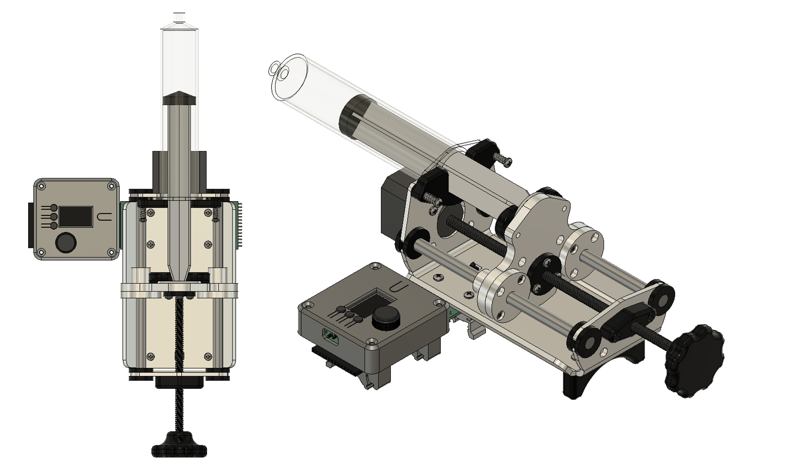
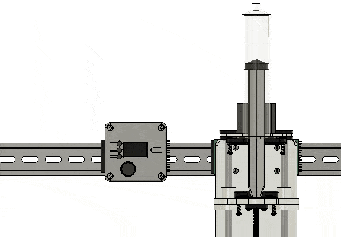

# Overview

/// caption
A single syringe pump connected to a controller
///

The aim of this project is to provide a capable, cost-effective, and easy-to-build syringe pump.
This documentation includes hardware design files, software source files, and instructions for building and using a [syringe pump](pump.md) and [controller](controller.md).

The design is modular, making it flexible and potentially compatible with a variety of pump hardware and control software.
A single controller can connect to up to four pumps. 
The pumps can be operated manually via the controller’s built-in display, buttons, and knob, or controlled remotely from software using serial commands (e.g., [pyControl](https://pycontrol.readthedocs.io/en/latest/)).

/// caption
Up to 4 pumps can be chained together and independently controlled
///

This project was developed in the [Karpova Lab](https://www.janelia.org/lab/karpova-lab) at HHMI's [Janelia Research Campus](https://www.janelia.org/).
## Features

<!-- - #### :material-arrow-up-down: Infuse and retract -->
- #### :material-ruler: Compact
    - 24 cm x 9 cm pump footprint
    - Can be mounted vertically to [DIN rail](https://www.digikey.com/short/q8mq0f3n)
- #### :material-volume-off: Silent operation
    - The controller uses a [TMC5041 motor driver](controller/TMC5041_datasheet_rev1.16.pdf) which features *StealthChop* for silent operation
- #### :material-arrow-collapse: Spring loaded clamps
    - Securely holds syringes in place while also allowing them to be quickly and easily loaded and unloaded
- #### :fontawesome-regular-hand-pointer: Rich interface
    - 1.14" color display with 240x135 pixels
    - 3 buttons for additional control
    - Rotary encoder with built-in push button
- #### :material-alert: Integrated Limit Switches
    - Pull limit prevents the plunger from being fully extracted from the barrel and making a mess
    - Push limit detects when a syringe is empty, enabling automatic session termination or seamless transition to another pump.
- #### :material-puzzle: Modular
    - The [controller](controller.md) accepts connector modules that provide platform specific connectors for power and communication.
    - A single controller can manage the electronics (stepper motor + limit switches) of up to 4 pumps via 0.1" pin headers.
- #### :octicons-stopwatch-16: Easy to source and build
    - Estimated cost of ~$175 per pump and ~$100 per controller. Only 1 controller is needed for up to 4 pumps.
    - [Less than 10 minutes to assemble](https://www.youtube.com/watch?v=5Peo_uu5sms)
- #### :simple-opensourcehardware: Open-source
    - Modify and customize to your needs
    - Share improvements with the community for everyone's benefit

## Specifications
### Flow rate
The max plunger speed is **30 cm/min[^1]**.
The max flow rate will depend on the syringe size used.
Multiply the max plunger speed by the cross-sectional area (cm^2^) of the syringe barrel to determine the flow rate (mL/min).
Details for some common syringes can be found [here](homepage/syringe_diameters.pdf).

Below are the max flow rates for some plastic BD syringes.

|                                              Syringe                                              	| Barrel inner diameter (cm) 	| Minimum volume[^2] (µL) 	| Maximum flow rate (mL/min) 	|
|:-------------------------------------------------------------------------------------------------:	|:-----------------------------:	|:--------------------------:	|:-----------------------------:	|
| [10 mL BD Luer-Lok](https://www.bd.com/en-us/products-and-solutions/products/product-page.302995) 	|              1.45             	|             1.7            	|               50              	|
| [30 mL BD Luer-Lok](https://www.bd.com/en-us/products-and-solutions/products/product-page.302832) 	|              2.17             	|             3.7            	|              111              	|
| [50 mL BD Luer-Lok](https://www.bd.com/en-us/products-and-solutions/products/product-page.309653) 	|              2.67             	|             5.6            	|              168              	|

[^1]: When powered by a 12V supply, this is a safe value where we don't see any signs of missed steps.
If you are pushing a viscous fluid, you may need to reduce the speed or increase the voltage up to 24V.

[^2]: Here we define the minimum volume as the volume that is dispensed from a single step rotation of the stepper motor.
This volume is a function of the lead screw pitch, the number of steps per revolution of the motor, and the cross-sectional area of the syringe barrel.
In this case, the lead screw pitch is 2 mm and the number of steps the motor has is 200, resulting in a carriage displacement of 10 µm per step.
Theoretically, since our stepper motor driver uses microstepping where it further divides the step size by 256, the minimum volume is 1/256th of the stated minimum volume.
In practice, other factors such as needle gauge, tubing properties (e.g. elasticity), fluid properties (viscosity, surface tension, etc.), and plunger properties (stiffness, friction, etc.) overshadow microstep size as the dominant source of variation.

!!! note "Modifications for different syringe sizes"
    The frame design and limit switch positions are based on the dimensions of a 50 mL plastic syringe, however
    you may want to use a smaller syringe for increased precision. 
    Alternaitve syringes can be used by adding an extension to the carriage for pushing the limit switch and modifying the [3D printed "clamp" parts](pump.md#3d-printed-parts) to adjust to the different syringe thickness.
    Design files for 30mL parts are available [here](pump.md#__tabbed_1_2).

### Accuracy and precision
Below is a comparison between this open-source syringe pump and a commercial [Harvard Apparatus PHD 2200](https://www.harvardapparatus.com/standard-infuse-withdraw-phd-22-2000-syringe-pumps.html) syringe pump.

??? info "Measurement details"
    The measurements were taken by dispensing liquid into a small beaker and then recording the weight using a digital scale.
    The liquid was dispensed in 50µL and 250µL increments through tubing and a 21 gauge needle that was submerged in the liquid (to avoid variations from droplet formation).
    For each pump, 50 samples at each volume were taken.

## Additional information

### Other open-source syringe pump projects

| Project                                                                                                                   | Author                                             |
| ------------------------------------------------------------------------------------------------------------------------- | -------------------------------------------------- |
| [Open-source syringe pump](http://www.mass-spec.ru/projects/diy/syringe_pump/eng/)                                        | Moscow State University's Mass Spectrometry Lab    |
| [Open-source syringe pump](http://www.appropedia.org/Open-source_syringe_pump)                                            | Michigan Tech's Open Sustainability Technology Lab |
| [Poisedon](https://pachterlab.github.io/poseidon/)                                                                        | Pachter Lab                                        |
| [3D Printed Syringe Pump Rack](https://hackaday.com/2015/05/29/pump-up-the-volume-with-the-3d-printed-syringe-pump-rack/) | aldricnegrier                                      |
| [DIY Syringe Pump](https://hackaday.com/2017/02/26/diy-syringe-pump-saves-big-bucks-for-hackers-lab/)                     | Naroom                                             |
| [OpenSyringePump](https://code.electrolab.fr/covid-19/opensyringepump)                                                    | Electrolab Hackerspace                             |

### Karpova Lab 

- [lab website](https://www.janelia.org/lab/karpova-lab)
- [GitHub](https://github.com/Karpova-Lab)

### pyControl 

- [official documentation](https://pycontrol.readthedocs.io/en/latest/)
- [forums / discussions](https://github.com/orgs/pyControl/discussions)
- [GitHub](https://github.com/pyControl)
- ready to purchase hardware at [Open Ephys Store](http://www.open-ephys.org/pycontrol) and [Labmaker](https://www.labmaker.org/collections/neuroscience/products/pycontrol-mouse-behaviour-box_set_no1)

### Documentation tools
- [MkDocs](https://www.mkdocs.org/)
- [Material for MkDocs](https://squidfunk.github.io/mkdocs-material/)
- [Interactive HTML BOM plugin for KiCad](https://github.com/openscopeproject/InteractiveHtmlBom)
- [Excalidraw](https://excalidraw.com/)
- [Markdown Tables Generator](https://www.tablesgenerator.com/markdown_tables)