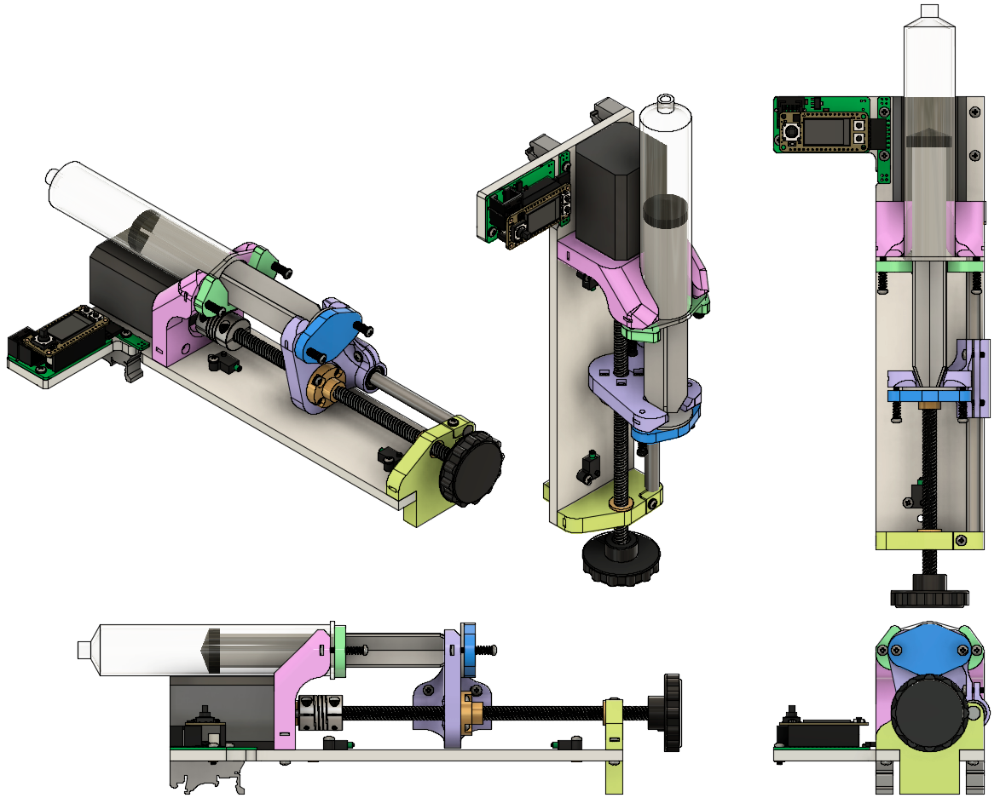

# Overview
The goal of this project is to provide an open-source syringe pump that is easy to procure and assemble, significantly less expensive than commercial pumps, while maintaining a sufficient level of dispense precision and accuracy. 
It was developed in the [Karpova Lab](https://www.janelia.org/lab/karpova-lab) at HHMI's Janelia research campus.

<a href="vertical_render.gif">
  
  </img>
</a>
<a href="iso_views.png">
  
  </img>
</a>

## Features
<!-- - Syringes, held securely in place with spring-loaded clamps, can be easily swapped in and out -->
- Infuse and retract
- Limit switches
- Spring loaded clamps provide secure holding while also allowing syringes to easily be swapped in and out
- Small footprint (330 mm x 140 mm x 100 mm)
  - Can be mounted vertically or set horizontally on surface
- Electronics designed to be modular
- Assembly time < 15 minutes
- Cost ~ $200
- Open source, so you can modify the designs to fit your needs and make improvements!
<!-- - Can receive commands over UART using [pyControl](https://pycontrol.readthedocs.io/en/latest/) -->
<!-- - Motor controller includes color display and joystick/buttons for manual control -->

## Performance
Below is a comparison between this DIY syringe pump and a commercial [Harvard Apparatus PHD 2200](https://www.harvardapparatus.com/standard-infuse-withdraw-phd-22-2000-syringe-pumps.html) syringe pump.

<!-- - Linear resolution = 5 µm. Volume resolution with 60mL syringe is 3 µL. -->
<!-- - Pressure -->

## Demo video

<iframe src="https://player.vimeo.com/video/543307158?title=0&byline=0&portrait=0" style="position:absolute;top:0;left:0;width:100%;height:100%;" frameborder="0" allow="autoplay; fullscreen; picture-in-picture" allowfullscreen></iframe>

 

## Further Resources

### More open source pumps

Here are some other projects you may be interested in:

- [Open-source syringe pump](http://www.mass-spec.ru/projects/diy/syringe_pump/eng/) by Moscow State University's Mass Spectrometry Lab
- [Open-source syringe pump](http://www.appropedia.org/Open-source_syringe_pump)  by Michigan Tech's Open Sustainability Technology Lab
- [Low cost laser cut syringe pump](https://web.archive.org/web/20211129184027/http://jvoigts.scripts.mit.edu/blog/low-cost-syringe-pump/#expand) by Jakob Voigts
- [Poisedon](https://pachterlab.github.io/poseidon/) by the Pachter Lab
- [3D Printed Syringe Pump Rack](https://hackaday.com/2015/05/29/pump-up-the-volume-with-the-3d-printed-syringe-pump-rack/) by aldricnegrier
- [DIY Syringe Pump](https://hackaday.com/2017/02/26/diy-syringe-pump-saves-big-bucks-for-hackers-lab/)  by Naroom
- [OpenSyringePump](https://code.electrolab.fr/covid-19/opensyringepump) by Electrolab Hackerspace

### Karpova Lab
- [Lab website](https://www.janelia.org/lab/karpova-lab)
- [GitHub](https://github.com/Karpova-Lab)

### pyControl 

- [Official documentation](https://pycontrol.readthedocs.io/en/latest/) 
- [Forums / discussions](https://github.com/orgs/pyControl/discussions) 
- [GitHub](https://github.com/pyControl) 
- Ready to purchase hardware at [Open Ephys Store](http://www.open-ephys.org/pycontrol) and [Labmaker](https://www.labmaker.org/collections/neuroscience/products/pycontrol-mouse-behaviour-box_set_no1)
