# Pump

[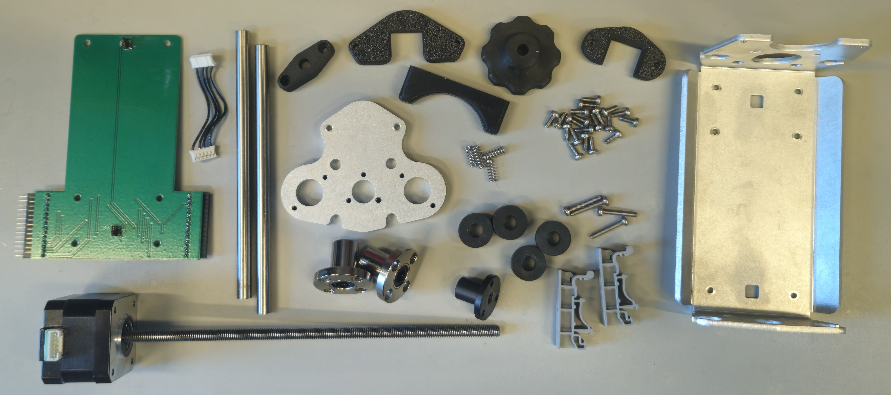](pump/assembly/parts.jpeg)
The pump hardware consists of bent aluminum sheet metal, 3D printed parts, and easily sourced off-the-shelf components.
A circuit board attaches to the base of the pump, integrating limit switches and providing connections for interfacing with the controller.

## Hardware

### Off the shelf hardware

| Quantity | Description              | Part Number                                                                                                                                                                                                                                                                     | Supplier      |
| :------: | ------------------------ | ------------------------------------------------------------------------------------------------------------------------------------------------------------------------------------------------------------------------------------------------------------------------------- | ------------- |
|    4     | Grommet                  | [9600K54](https://www.mcmaster.com/9600K54/)                                                                                                                                                                                                                                    | McMaster-Carr |
|    4     | Spring                   | [9657K267](https://www.mcmaster.com/#9657K267)                                                                                                                                                                                                                                  | McMaster-Carr |
|    20    | M3 x 8 mm machine screw  | [92000A118](https://www.mcmaster.com/92000A118/)                                                                                                                                                                                                                                | McMaster-Carr |
|    4     | M3 x 20 mm machine screw | [92000A128](https://www.mcmaster.com/92000A128/)                                                                                                                                                                                                                                | McMaster-Carr |
|    5     | M3 thin square nut       | [97259A101](https://www.mcmaster.com/97259A101/)                                                                                                                                                                                                                                | McMaster-Carr |
|    2     | 150 x 8 mm shaft         | [2100-0008-0150](https://www.gobilda.com/8mm-shaft-stainless-steel-150mm-length/)                                                                                                                                                                                               | goBILDA       |
|    2     | Flanged linear bearing   | [B09F39149G](https://www.amazon.com/uxcell-LMF8UU-Bearings-Machine-Printer/dp/B09F39149G?crid=33A0A8KOBNF4M&dib=eyJ2IjoiMSJ9.p18b5Fpf1wLqtE1F8Ssl2A.j_Kj4-zMElHbYsxWr8tMpAeZfyr8Vah8kdK9J9OeUJg&dib_tag=se&keywords=B09F39149G&qid=1731625315&sprefix=b09f39149g,aps,60&sr=8-1) | Amazon        |
|    2     | DIN rail adapter         | [1201578](https://www.digikey.com/products/en?keywords=277-2296-nd)                                                                                                                                                                                                             | Digi-Key      |
|    1     | 6-pos plug housing       | [PHR-6](https://www.digikey.com/en/products/detail/jst-sales-america-inc/PHR-6/608604)                                                                                                                                                                                          | Digi-Key      |
|    4     | 2 inch pre-crimped leads | [ASPHSPH24K51](https://www.digikey.com/en/products/detail/jst-sales-america-inc/ASPHSPH24K51/6009457?s=N4IgTCBcDaICwFYEFoDMAGAHARhAXQF8g)                                                                                                                                       | Digi-Key      |
|    1     | Linear stepper motor     | [17E13S0404AF4-200RS](https://www.omc-stepperonline.com/nema-17-external-34mm-stack-0-4a-lead-2mm-0-07874-length-200mm-17e13s0404af4-200rs)                                                                                                                                     | STEPPERONLINE |

!!! warning "Cable assembly"
    Use the pre-crimped leads and plug housing to make a cable that looks like the one in the image below.
    [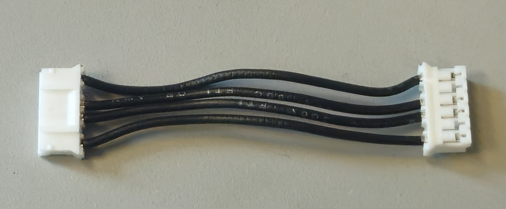](pump/images/cable_assembly.jpg)

### Sheet metal parts
!!! info "Ordering metal parts"
    [SendCutSend](https://sendcutsend.com/) and [OSH Cut](https://www.oshcut.com/) offer cutting and bending services.

-   **Frame**

    ---
	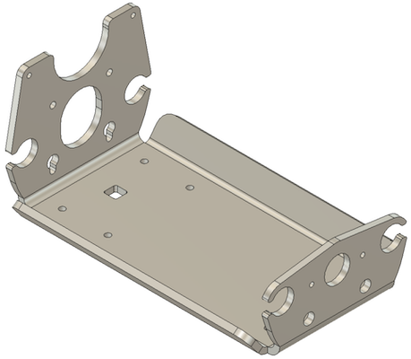

    - 0.125" aluminum
    - Four M3 x 0.5 mm tapped holes
    - Two 90° and two 52° bends

    [:material-file-download: frame.step](pump/cad/frame_250108.step){ .md-button }

    [:material-file-download: frame.dxf](pump/cad/frame_250108.dxf){ .md-button }

-   **Carriage**

    ---
	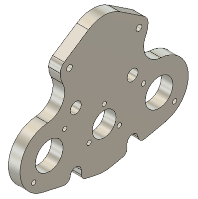

    - 0.25" aluminum
    - Seven M3 x 0.5 mm tapped holes

    [:material-file-download: carriage.step](pump/cad/carriage_250108.step){ .md-button }

    [:material-file-download: carriage.dxf](pump/cad/carriage_250108.dxf){ .md-button }

### 3D printed parts

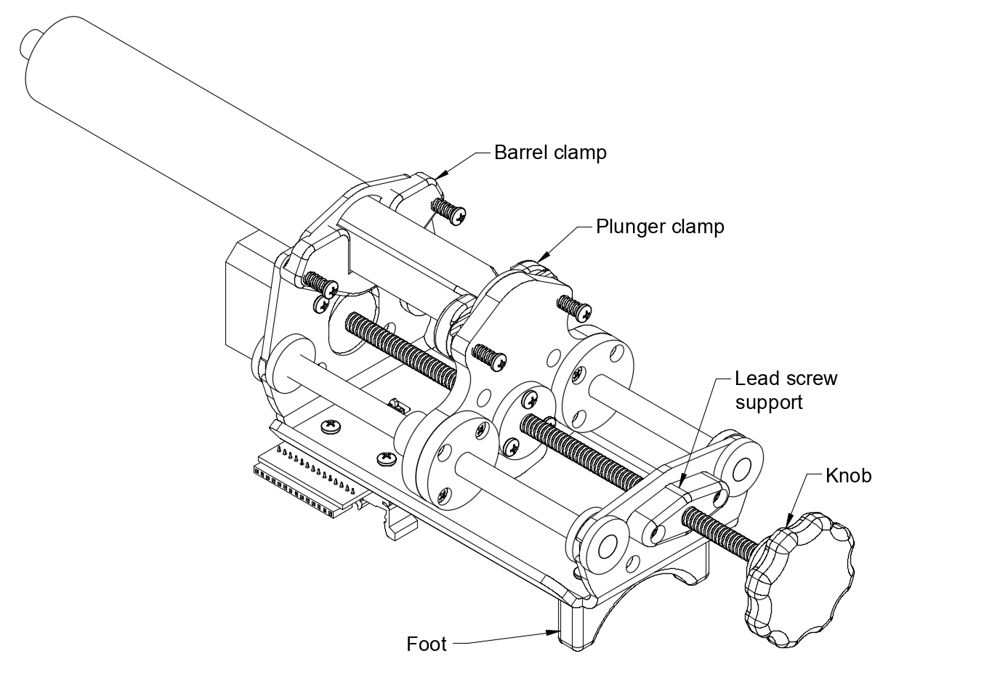
/// caption
3D printed parts
///

!!! warning "Printing requirements for embedded nuts"

    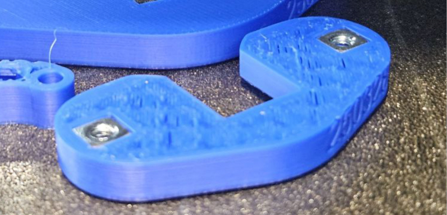
    /// caption
    Printing is paused to insert nuts. They become embedded in the plastic part as the print continues.
    ///

    The foot, plunger clamp, and knob incorporate [M3 square nuts](https://www.mcmaster.com/97259A101/).
    In your slicer software, you will need to specify a layer to pause the printing (see table below).
    During the print when the pause occurs, you will need to insert the nut(s), and then tell the printer to continue printing.

    |     Part      | Pause at start of layer |
    | :-----------: | :---------------------: |
    |     Foot      |           35            |
    | Plunger clamp |           75            |
    |     Knob      |           204           |

    !!! warning "Layer height"
        To ensure proper fitment of the nuts, it is important to print these parts with a layer height of **0.08 mm**.

!!! success "Verified setup"
    Parts have been tested and confirmed to work using the following setup:

    - Printer: Bambu X1E
    - Nozzle diameter: 0.4 mm
    - Material: [PLA](https://us.store.bambulab.com/collections/bambu-lab-3d-printer-filament/products/pla-basic-filament?variant=40988815556744)
    - Slicer: [OrcaSlicer v2.2.0](https://github.com/SoftFever/OrcaSlicer/releases/tag/v2.2.0)
    - Layer height: 0.08 mm

=== "50 mL"

    [:material-file-download: printed_parts_50mL.3mf](pump/cad/printed_parts_50mL.3mf){ .md-button }

    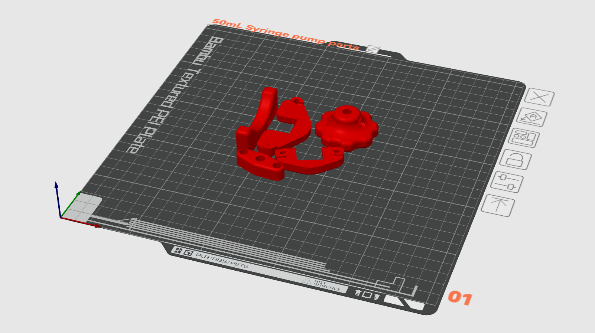

=== "30 mL"

    [:material-file-download: printed_parts_30mL.3mf](pump/cad/printed_parts_30mL.3mf){ .md-button }

    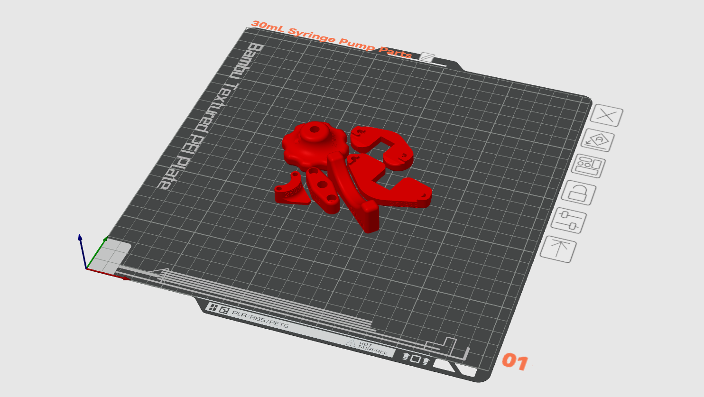

    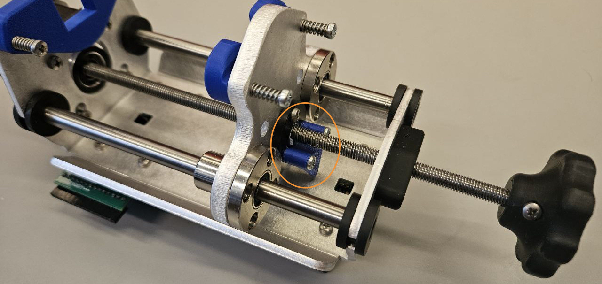
    /// caption
    Extension piece added to the carriage to ensure the retraction limit switch is properly triggered. Replace bottom two M3 x 8mm screws with M3 x 20mm screws.
    ///

## Printed circuit board

!!! tip "Ordering PCBs"
    Order the PCB from [OSH Park](https://oshpark.com/) or [Aisler](https://aisler.net/), or manually upload the gerber files to your preferred PCB manufacturer.

[:material-file-download: Download gerber files](pump/cad/base_v0.9.zip){ .md-button }

[:material-cart: Order from OSH Park](https://oshpark.com/shared_projects/RqSzRjXG){ .md-button } [:material-cart: Order from Aisler](https://aisler.net/p/SLYDTMZQ){ .md-button }

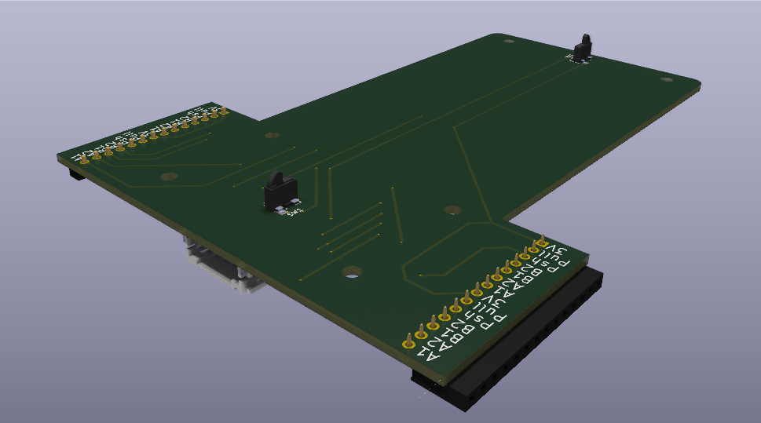

-   #### Schematic
    ---
    [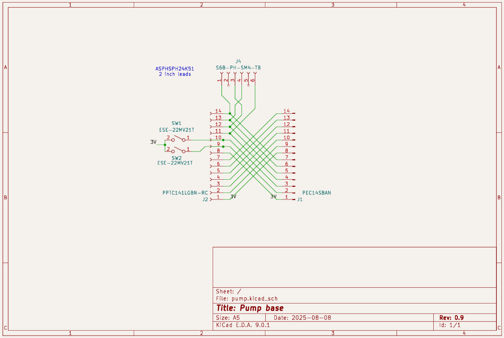](pump/images/pcb_schematic.png)

-   #### Layout
    ---
    [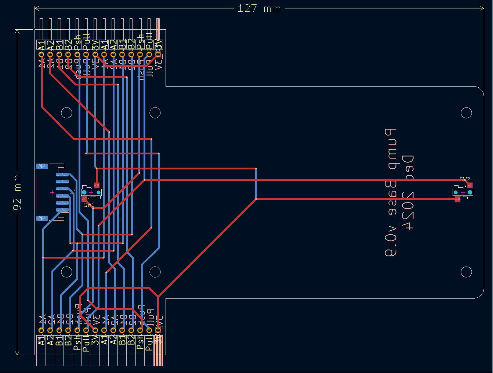](pump/images/pcb_layout.png)

### Bill of Materials
| Quantity | Reference | Description                      | Value/MPN                                                                                                                                          |
| :------: | --------- | -------------------------------- | -------------------------------------------------------------------------------------------------------------------------------------------------- |
|    1     | J1        | 14-pin right angle male header   | [PH1RB-14-UA](https://www.digikey.com/en/products/detail/adam-tech/PH1RB-14-UA/9831063?s=N4IgTCBcDa4AwFYDsBaACgCQIwCUBCKWALCgKoCCKAcgCIgC6AvkA)    |
|    1     | J2        | 14-pin right angle female header | [PPTC141LGBN-RC](https://www.digikey.com/en/products/detail/sullins-connector-solutions/PPTC141LGBN-RC/775908)                                     |
|    1     | J4        | 6-pos right angle socket         | [S6B-PH-SM4-TB](https://www.digikey.com/en/products/detail/jst-sales-america-inc/S6B-PH-SM4-TB/926659?s=N4IgTCBcDaICwFYEFoDKA2AQsgCgCTQFk4QBdAXyA) |
|    1     | SW1,SW2   | Limit switch                     | [ESE-22MV21T](https://www.digikey.com/en/products/detail/panasonic-electronic-components/ESE-22MV21T/1245478)                                      |

## Assembly

### Video

  <iframe src="https://www.youtube.com/embed/5Peo_uu5sms" style="position: absolute; top: 0; left: 0; width: 100%; height: 100%; border:0;" allowfullscreen title="YouTube Video"></iframe>

### Required tools

- Phillips screwdriver with a reach greater than 6" ([5682A79](https://www.mcmaster.com/5682A79/))

### Instructions

#### 1. Assemble carriage 
- (7) M3 x 8mm screws
- (2) M3 x 20mm screws
- (2) springs
- (2) linear bearings
- (1) carriage
- (1) lead nut
- (1) plunger clamp

=== "parts"
    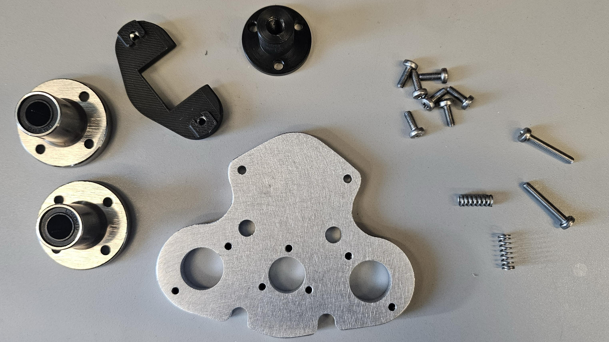

=== "assembled"
    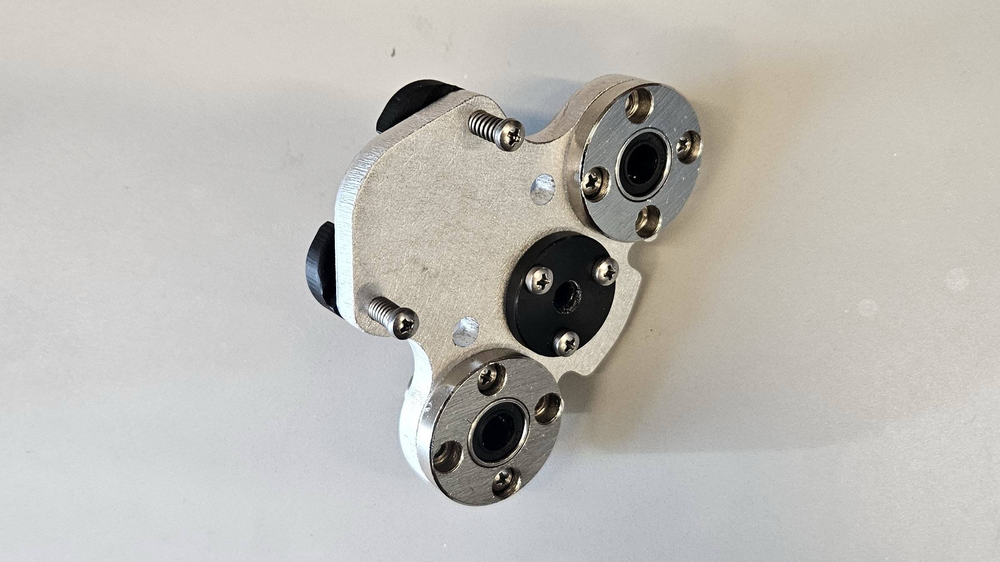

#### 2. Attach base PCB and feet
- (6) M3 x 8mm screws
- (2) DIN rail adapters
- (1) foot
- (1) base PCB
- (1) frame

=== "parts"
    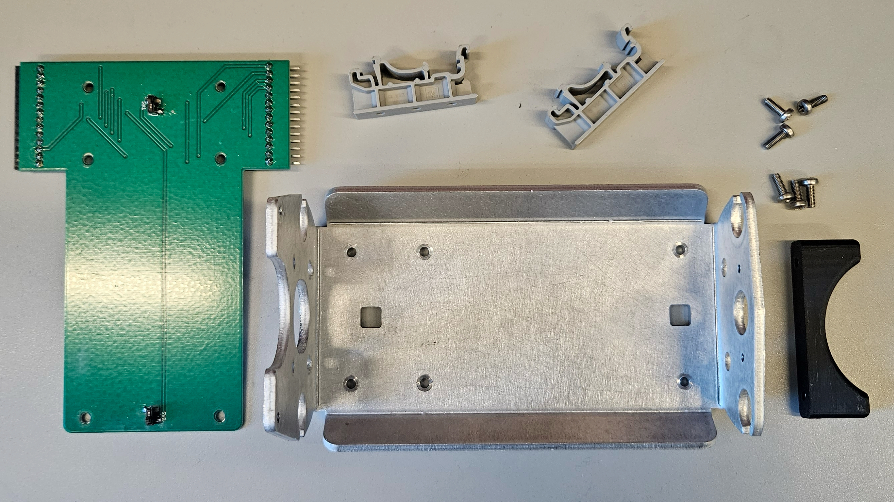

=== "assembled"
    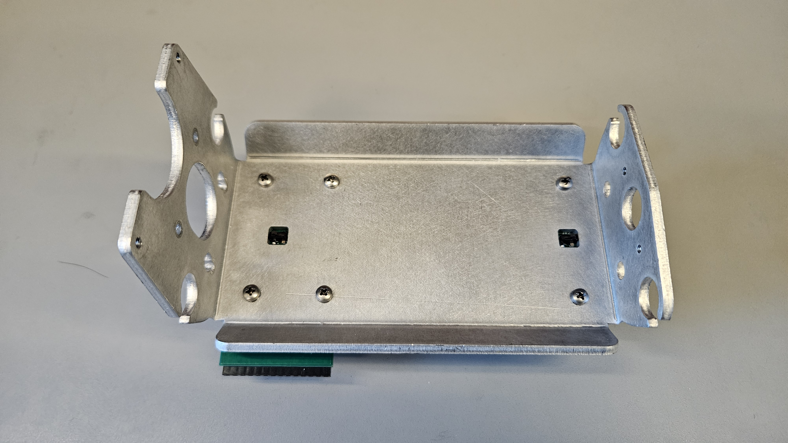

#### 3. Attach barrel clamp
- (2) M3 x 20mm screws
- (2) springs
- (1) barrel clamp

=== "parts"
    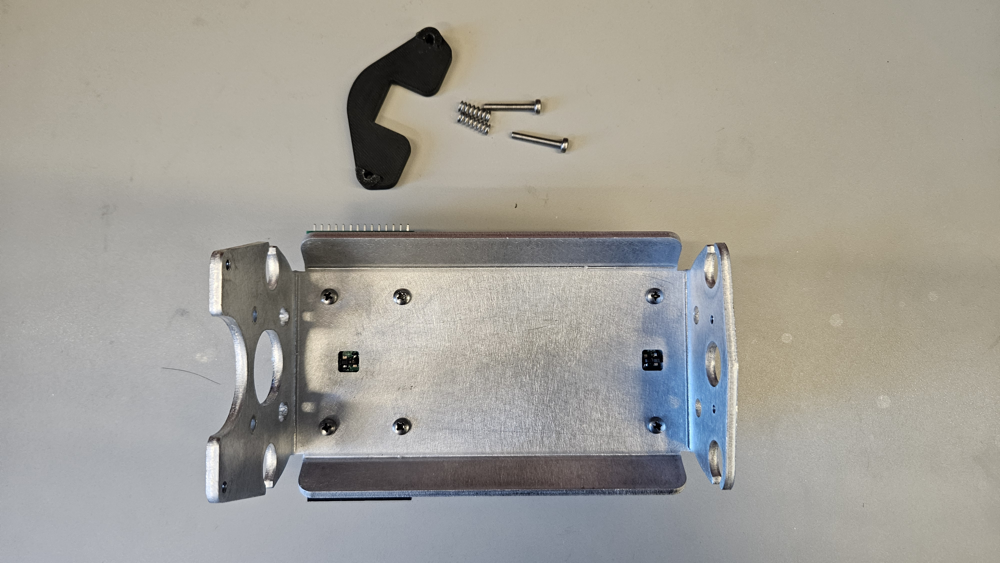

=== "assembled"
    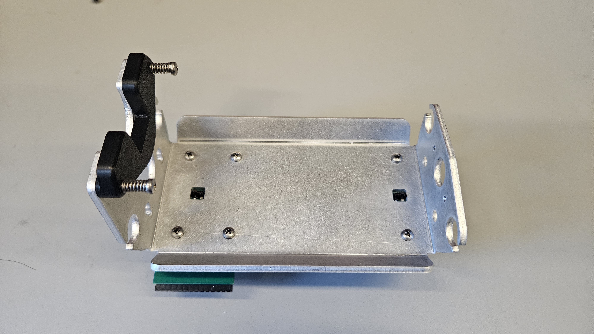

#### 4. Mount linear motor and carriage
- (4) M3 x 8mm screws
- (1) linear motor
- (1) carriage assembly

=== "parts"
    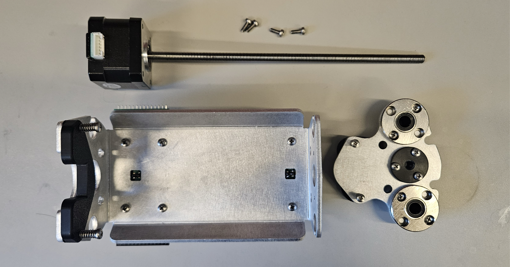

=== "assembled"
    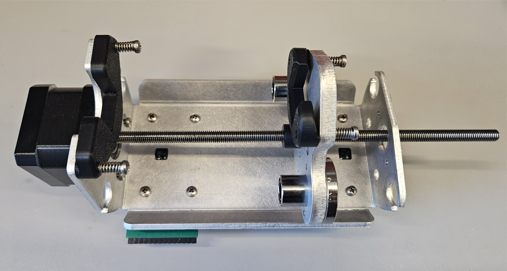

#### 5. Add Linear rods 
- (4) grommets
- (2) linear rods

=== "parts"
    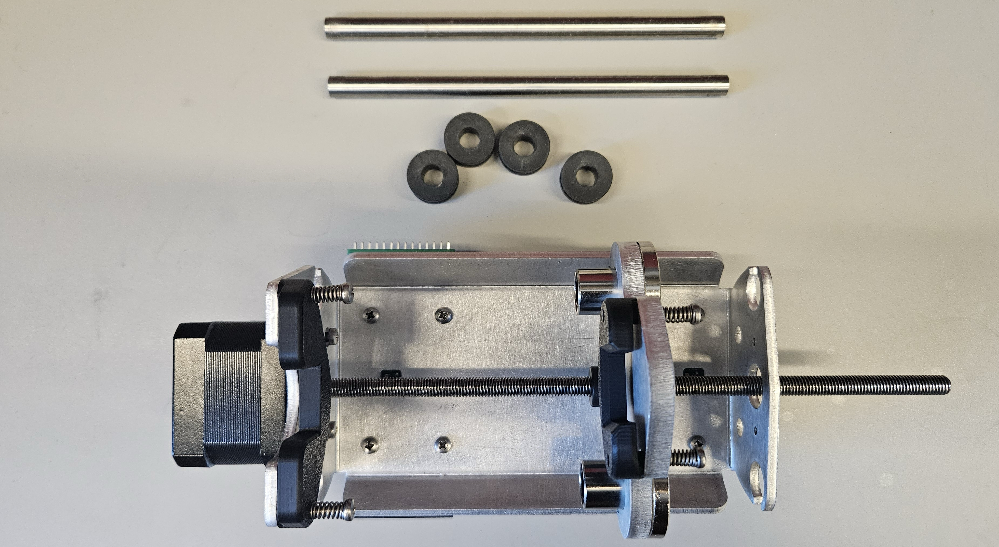

=== "assembled"
    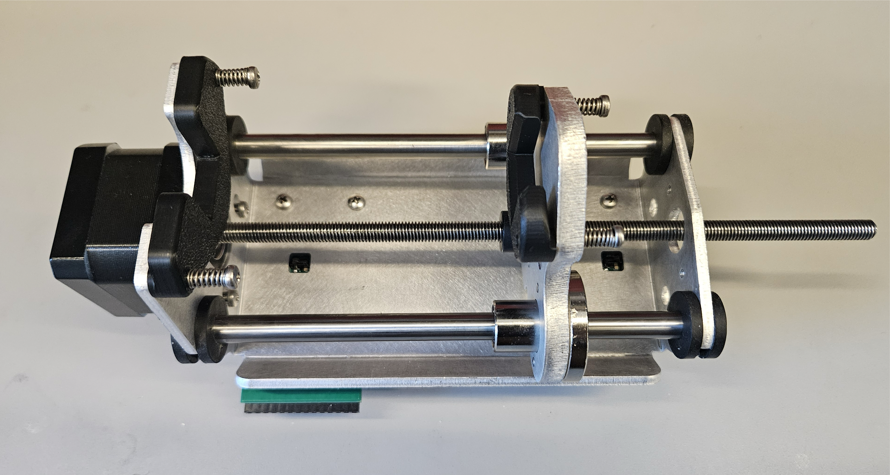

#### 6. Attach end support, knob, and motor cable
- (3) M3 x 8mm screws
- (1) lead screw support
- (1) knob
- (1) cable assembly

=== "parts"
    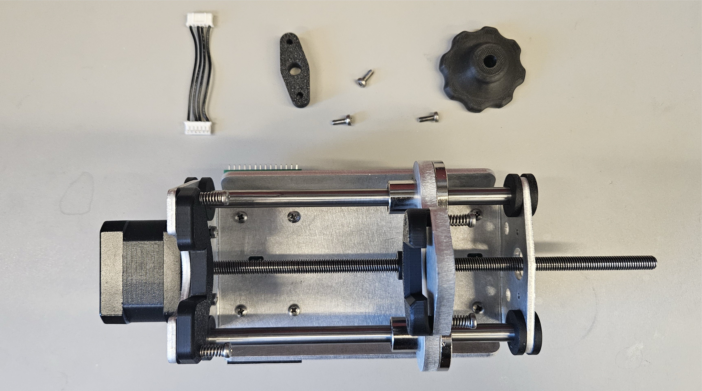

=== "assembled"
    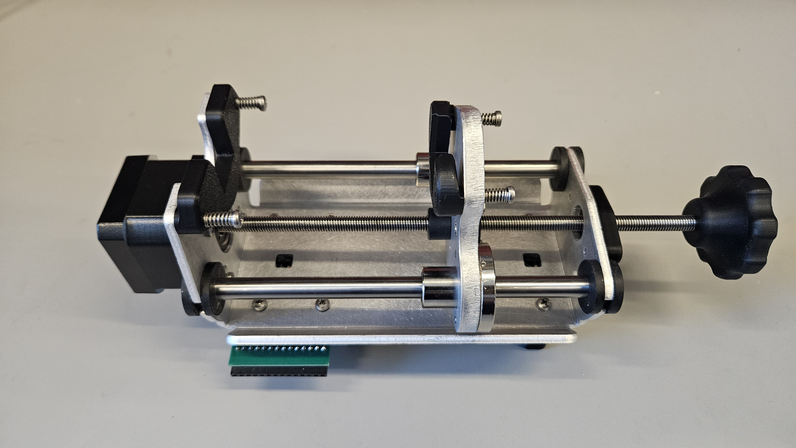

## Maintenance

Apply [white lithium grease](https://www.amazon.com/WD-40-Specialist-Protective-Lithium-Grease-Straw-Sprays/dp/B00L35DAWQ?th=1) to the lead screw and [multi-purpose oil](https://www.amazon.com/3-ONE-100355-Multi-Purpose-Pack/dp/B0002JN5PG?) to the linear rods and bearings. 

