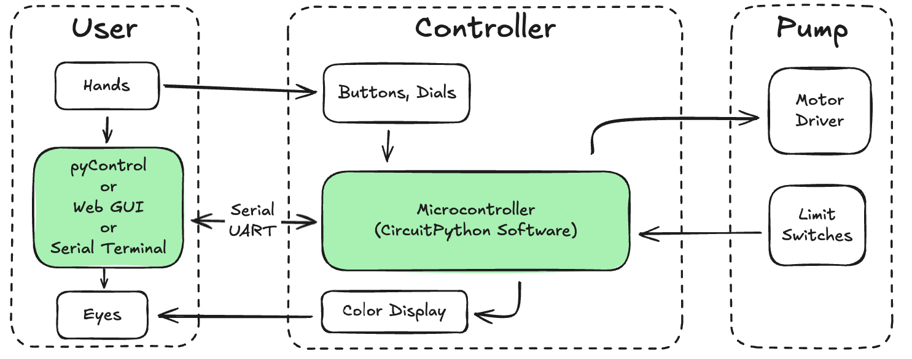
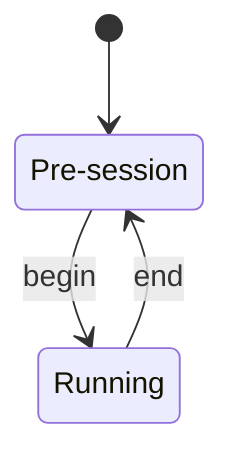
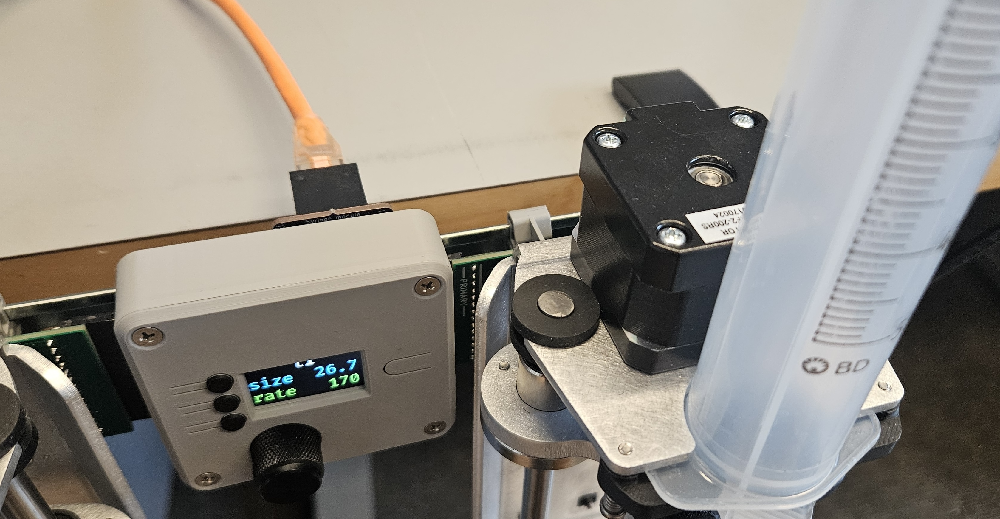
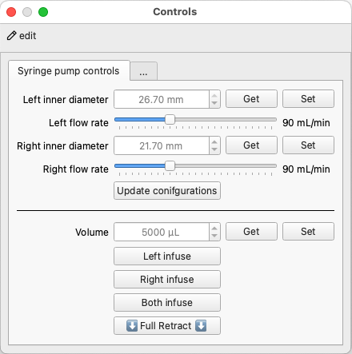
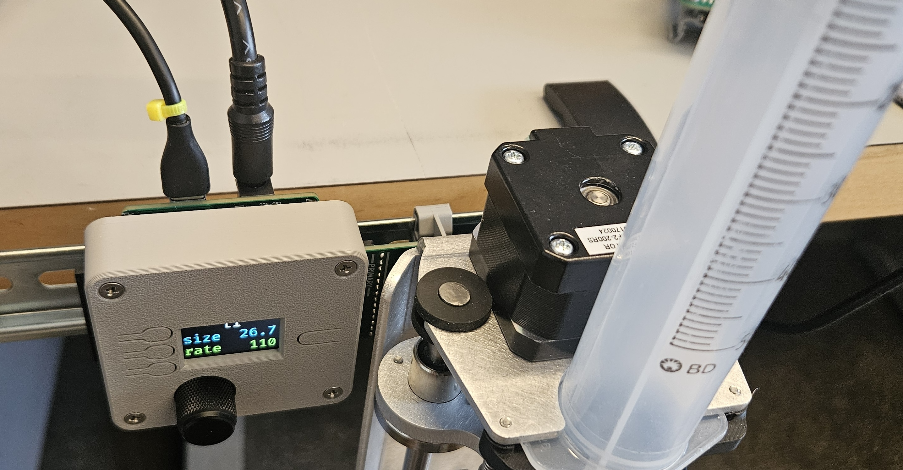
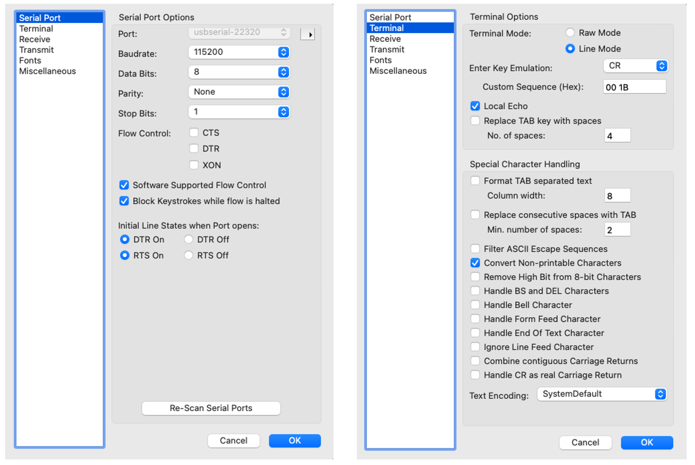
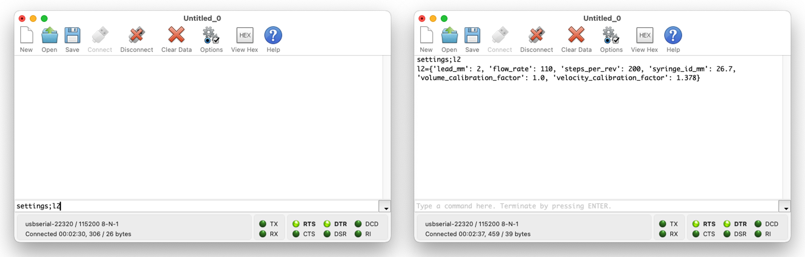

# Software

<!-- Controlling the pumps requires software running on the microcontroller.  -->
Software runs on the microcontroller to respond to user commands as well as monitor and control the pumps.
Beyond manual inputs from physical buttons and dials, control can also occur through serial communication between the microcontroller and software running on a computer.

## CircuitPython

The [controller's](controller.md) software is built on top of CircuitPython.
With the CircuitPython interpreter loaded onto the microcontroller, it will show up as a drive when connected to your computer.
To write code on it, simply drag and drop a Python file onto the drive.
The code can be updated by editing the .py file with a text editor and saving it.
The microcontroller will automatically restart and run the new code, no recompiling or binary creation/upload necessary!

### Getting CircuitPython onto the microcontroller

Refer to the [official guide](https://learn.adafruit.com/esp32-s3-reverse-tft-feather/install-circuitpython) to install CircuitPython or follow the instructions below.

1. Download UF2 from [circuitpython.org](https://circuitpython.org/board/adafruit_feather_esp32s3_reverse_tft/)
2. Double click reset button to enter boot mode (press reset, then while the onboard LED is still purple, press reset again)
	- The TFT screen should show a green blue and orange pattern on the screen
	- A `FTHRS3BOOT` drive should appear on your computer
- Drag your UF2 file onto the `FTHRS3BOOT` drive
	- Once the file is finished transferring, the board will reset and a `CIRCUITPY` drive should appear on your computer

### Useful programming resources

- [CircuitPython overview](https://learn.adafruit.com/welcome-to-circuitpython/overview)
- [CircuitPython essentials](https://learn.adafruit.com/circuitpython-essentials/circuitpython-essentials)
- [ESP32-S3 Reverse TFT Feather essentials](https://learn.adafruit.com/esp32-s3-reverse-tft-feather/digital-input)
- [Using displayio](https://learn.adafruit.com/circuitpython-display-support-using-displayio/ui-quickstart)
- [Todbot's CircuitPython tricks](https://learn.adafruit.com/todbot-circuitpython-tricks/overview)

## Basic example
The CircuitPython code examples below demonstrate the controller's ability to receive and send serial UART messages, respond to button presses and knob rotations, and display information on the screen.
You can modify and build on these examples or write your own custom solution from scratch.

The same microcontroller software is used for all the examples below.

- Download and unzip [:material-file-download: basic-firmware.zip](software/basic-firmware.zip)
- Move the contents onto the `CIRCUITPY` drive.

The code is written as a simple state machine with two states: `pre-session` and `running`.
Organizing the code in this way makes it easy to create separate interfaces and functionality for each state.

For example, before a session you may want to enable manual movement of the plunger and to show the pump settings on the screen, whereas during a session you may want to restrict motion to only commands received from the computer and display session-specific information like animal ID and running total of volume dispensed.

### Manual control

- The top button cycles through the 4 available pumps.
- The middle button toggles the syringe inner diameter between 26.7 mm (50mL syringe) and 21.7 mm (30mL syringe)
- The bottom button toggles the pump flow rate between 110 and 50 mL/min.
- Rotating the knob will CW will infuse, CCW will retract.
- Pressing the knob as a button will stop the motion if the pump is moving.
- Pressing and holding the knob button for 1 second will retract the pump fully until it hits the limit switch.
- The display background will turn red if a limit switch is pressed.

### UART control
You will need to create a serial connection to the microcontroller from your computer.
You can download a [serial terminal](https://learn.sparkfun.com/tutorials/terminal-basics/serial-terminal-overview) and directly send commands from it, or write your own serial interface, for example using a Python script with the [pySerial](https://pyserial.readthedocs.io/en/latest/pyserial.html) library.

The serial connection is configured as follows:

- 115200 baud
- 8 data bits
- 1 stop bit
- no parity
- no flow control

A message consists of a command and value(s), separated by a semicolons and ending with a newline character.

The available pump IDs are `l1`, `r1`, `l2`, `r2`.
#### Read commands

| **Description**      | **Example Write Message** | **Example Return Message**                                                      |
| -------------------- | ------------------------- | ------------------------------------------------------------------------------- |
| Get firmware version | `'version;\n'`            | `'2025-06-17\n'`                                                                |
| Get pump settings    | `'settings;l1\n'`         | `{'lead_mm': 2, 'flow_rate': 110, 'steps_per_rev': 200, 'syringe_id_mm': 26.7, 'volume_calibration_factor': 1.0, 'velocity_calibration_factor': 1.378}` |

#### Write commands

| **Description**                 | **Example Write Message** |
| ------------------------------- | ------------------------- |
| Set syringe inner diameter (mm) | `'diameter;l2;26.7\n'`    |
| Set flow rate (mL/min)          | `'flow_rate;r1;90\n'`     |
| Infuse volume (µL)              | `'dispense;r2;500\n'`     |
| Retract volume (µL)             | `'dispense;r2;-60000\n'`  |
| Stop pump                       | `'stop;l1\n'`             |
| Calibrate pump                  | `'calibrate;r2\n'`        |
| Go to running state             | `'begin\n'`               |
| Return to pre-session state     | `'end\n'`                 |

### Interface examples

#### pyControl interface

!!! success "pyControl Module"
	
	When paired with a [pyControl module](controller.md#pycontrol-module), the syringe controller can be easily connected through an RJ45 cable and used as a pyControl device.

!!! warning
	The pump must be plugged into a port that has a serial UART. 

	- For [Breakout board 1.2](https://pycontrol.readthedocs.io/en/latest/user-guide/pump/#breakout-boards), this can be ports 1, 3 or 4.
	- For [D-series Breakout Board 1.6](https://karpova-lab.github.io/pyControl-D-Series-Breakout/index.html#), this can be ports 8, 10, 11 or 12.

The following example assumes that the syringe pump is plugged into port 4 of [Breakout board 1.2](https://pycontrol.readthedocs.io/en/latest/user-guide/hardware/#breakout-boards). Edit the code to use the correct board and port for your setup.

1. Download [:material-file-download: pump_controller.py](software/pycontrol/pump_controller.py) and [:material-file-download: uart_handler.py](software/pycontrol/uart_handler.py) and place them in your `devices` directory. 
2. Download [:material-file-download: syringe_demo.py](software/pycontrol/syringe_demo.py) and place it in your `tasks` directory. 
3. Download [:material-file-download: syringepump_gui.json](software/pycontrol/syringepump_gui.json) and place it in your `controls_dialogs` directory. 
4. Open up pyControl GUI
5. Connect to your board
6. Click the `Config` button and then click `Load framework`. This will ensure the `pump_controller.py` and `uart_handler.py` are transferred onto the pyBoard microcontroller. 
7. Run the syringe_demo task
8. Click the `Controls` button to open the controls dialog and send commands to the pump. Updates to the settings will be reflected in the controller's display.

/// caption
Send commands to update pump settings and extend/retract the plunger using the custom syringe pump controls dialog.
///

---

!!! success "USB Module"
	When paired with a [USB module](controller.md#usb-module), the syringe controller can be easily used with a serial terminal or web interface. 
	Provide 12V power and a USB connection to the controller.
	

#### CoolTerm
Below is an example of how to set up [CoolTerm](https://freeware.the-meiers.org/) to communicate with the syringe pump.

- Change terminal mode to `Line Mode`
- Change Enter Key emulation to `CR`
- Turn on Local Echo

/// caption
CoolTerm settings
///

Try sending some [commands](#read-commands) to the pump.

/// caption
Left: typing in settings command. Right: after command is sent, the terminal echos the command and displays the returned pump settings that were sent back from the microcontroller.
///

#### Web interface
Below is a demonstration of creating a custom GUI for sending and receiving serial commands.
Click below to launch a web interface.
It only uses client-side code (HTML, CSS, JavaScript) that runs in the browser, no server-side code is required.
The GUI allows you to individually modify motion settings as well as infuse and retract each of the four pumps.

!!! warning
	The web interface uses [webserial](https://developer.mozilla.org/en-US/docs/Web/API/Web_Serial_API) to communicate with your computer's USB port. 
	This feature is available in the latest desktop #Browsers_based_on_Chromium). 
	If you encounter issues, try switching to a recent version of a [compatible browser](https://caniuse.com/web-serial) such as: [Chrome](https://www.google.com/chrome/), [Edge](https://www.microsoft.com/en-us/edge/download?form=MA13FJ), or [Opera](https://www.opera.com/).

<a href="syringe-web-interface.html">

</img>
</a>
